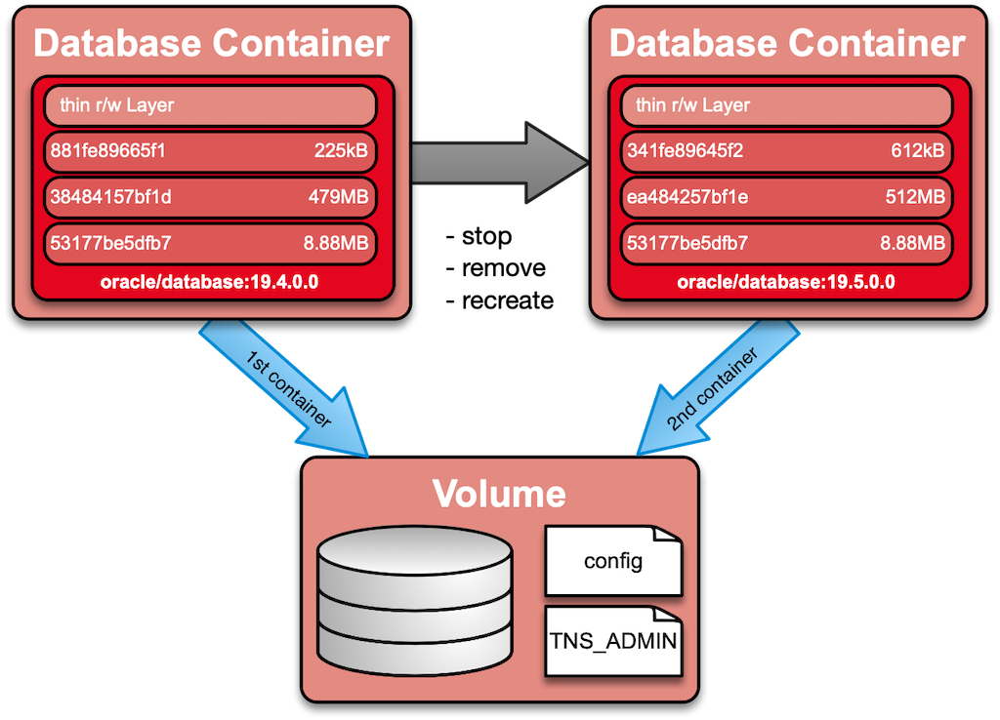
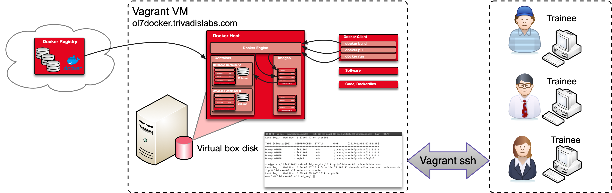

Preface
=======

About O-DB-DOCKER
-----------------

Oracle has long supported the use of Docker to install its products,
including the latest versions of the Oracle database.

In theory, a simple "docker run" instantiates a corresponding container
from a docker image. But why isn't the database container ready in a few
seconds?? Where does Oracle Database Image come from and what happens if
the container is stopped again? The functional scope as well as the size
of the Oracle database container presuppose that one or the other
thoughts about the use and operation are made in advance. This includes
topics such as data persistence, licensing and other operational
aspects.

With a focus on the current versions of Oracle Database and Oracle
Unified Directory the following topics will be discussed:

-   Docker overview with focus on images, containers and volumes.
-   Structure of Oracle Docker Images
-   Operating an Oracle Docker Database Container
-   Various use cases for Oracle database docker containers such as
    Oracle Enterprise, User Security, Test and Engineering databases,
    Migration and more.
-   Other topics such as high availability, backup & recovery and
    licensing.

Within the scope of this training, basics and extended know-how in the
area of Oracle database and Docker will be elaborated. The theory will
be accompanied by demos and practical exercises.

Disclaimer
----------

This guide has been created with utmost care, but does not claim to be
complete. It was compiled as part of the preparation for the
*O-DB-DOCKER* workshop. The author assumes no responsibility for the
accuracy, completeness and timeliness of the content. The use of the
available content is at your own risk.

Document information
--------------------

-   **Document:** O-DB-DOCKER Workshop
-   **Classification:** Restricted / Trivadis customer
-   **Status:** Published
-   **Last changes:** 2019.11.21
-   **Document name:** O-DB-DOCKER\_Workshop.pdf

  Lead Authors    Contributors & Reviewers
  --------------- --------------------------
  Stefan Oehrli   Martin Berger

Revision History
----------------

  Version     Date         Visa   Comment
  ----------- ------------ ------ ------------------------------------------------
  0.1         2019.10.12   soe    Initial release O-DB-DOCKER workshop
  0.2         2019.10.17          Add Lab requirements
  0.3 - 0.8   2019.11.19          Add initial version of Lab exercises
  1.0         2019.11.20   soe    First official release of O-DB-DOCKER workshop

If you have any questions, please do not hesitate to contact us via
[stefan.oehrli\@trivadis.com](stefan.oehrli@trivadis.com).

Workshop Introduction
=====================

Requirements Workshop Environment
---------------------------------

During the workshop ***O-DB-DOCKER*** *Oracle-Databases in
Docker-Containers* there will be the possibility to explore different
topics with practical examples. Each participant will be provided with a
compute node in the Oracle Cloud for the duration of the
***O-DB-DOCKER*** training. Alternatively, participants can perform the
exercises in their own local VM or Docker environment. Participants are
free to choose which environment they want to use for the workshop.
Although the setup of the local VM respectively local Docker environment
is not part of the workshop itself. The following summary gives a short
overview of the different requirements for the three workshop
environments.

Detailed information on the workshop environment, documents,
instructions etc. are available prior to the training via [DOAG2019
O-DB-DOCKER](https://url.oradba.ch/DOAG2019_O-DB-DOCKER).

Skills and Knowledge
--------------------

The different exercises of the workshop allow a step-by-step
introduction to the topic *Oracle databases in Docker containers*. The
following knowledge of the participants is recommended:

-   Oracle database basics like installation, configuration and basic
    database administration
-   Docker basics (see also [Get Started, Part 1: Orientation and
    setup](https://docs.docker.com/get-started/))
-   Practical experience with shell scripts, SSH and the command line.

Compute Node in the Oracle Cloud
--------------------------------

The Compute Node in the Oracle Cloud will be specially prepared for this
workshop and will be available for practical work for the duration of
the training. Each compute node is configured as follows:

-   *Host name:* ol7dockerXX.trivadislabs.com (See host overview
    provided by the teacher.)
-   *Internal IP address:* 10.0.0.2
-   *External IP address:* See host overview provided by the teacher.
-   *VM shape:* VM.Standard2.2
    -   *CPU:* 2.0 GHz Intel® Xeon® Platinum 8167M (2 Cores)
    -   *Memory:* 30GB
    -   *Disk:* ca 256GB
-   *Software:*
    -   Oracle Enterprise Linux 7.7
    -   Docker Engine / Community Edition
    -   Predefined Docker Images
    -   Miscellaneous Oracle binaries and Git client

The following figure gives an overview of the OCI compute instance and
access via SSH. Detailed installation and configuration guide can be
found in [Appendix A](#appendix-a-setup-oci-environment).


Access to the compute nodes is exclusively via SSH and Private Keys.
Workshop participants must ensure that they meet the following
requirements:

-   *SSH client* for remote access, e.g. Putty, MobaXterm or similar.
-   *SCP Client* to copy files remotely, e.g. WinSCP, Putty or similar.
-   *Text editor* for customizing / developing docker files, scripts
    etc. e.g. MS Visual Studio Code, UltraEdit, Notepad++ or similar
-   It must also be ensured that access to a public IP address or host
    name is possible via an SSH key.

The following *optional* points are recommended:

-   GitHub account to access and download the source code. Simple
    download does not require an account.

Local Vagrant VM
----------------

As with compute nodes, all exercises can be performed directly in a
Local VM. Appropriate vagrant scripts for building a VM are available in
the Git Repository
[oehrlis/o-db-docker](https://github.com/oehrlis/o-db-docker). The
following requirements must be met in order to set up this VM with
Vagrant:

-   [Virtualbox](https://www.virtualbox.org/wiki/Downloads)
-   [Vagrant](https://www.vagrantup.com)
-   Local clone of the Git repository
    [oehrlis/o-db-docker](https://github.com/oehrlis/o-db-docker)
-   Oracle Binaries for Oracle 19c and current RU.
-   Sufficient hard disk space for the VM and the Docker Images approx.
    50GB
-   If necessary, additional tools to access and work with the VM,
    e.g. SSH client, text editor, etc.

Setting up a local VM is not part of the workshop. Participants who wish
to work with a VM must configure it in advance. Detailed installation
and configuration guide can be found in [Appendix
B](#appendix-b-setup-vagrant-environment).

Local Docker Environment
------------------------

As a third option, the exercises can also be performed in a local docker
environment. This is especially useful for working on Linux or MacOS
notebooks. In order to perform the workshop locally, the following
requirements must be met:

-   Installing the Docker Community Edition. See also [About Docker -
    Community](https://docs.docker.com/install/)
-   Local clone of the Git repository
    [oehrlis/o-db-docker](https://github.com/oehrlis/o-db-docker) and
    [oracle/docker-images)](https://github.com/oracle/docker-images)
-   Oracle Binaries for Oracle 19c and current RU.
-   Sufficient hard disk space for the VM and the Docker Images approx.
    50GB
-   If necessary, additional tools to access and work with the VM,
    e.g. SSH client, text editor, git client etc.

Building a local Docker environment is not part of the workshop.
Participants who wish to work with a local Docker installation must
configure it in advance. detailed installation and configuration guide
can be found in [Appendix
C](#appendix-c-setup-local-docker-environment).

Workshop Exercises
==================

Overview of Exercises
---------------------

The exercises are grouped in individual directories and can generally be
performed independently of each other. Each exercise contains at least a
short description of the tasks (`1x??en-Exercise.md`) as well as a
solution (`1x??en-Solution.md`). In addition, scripts, docker files,
etc. are part of every exercise. For exercises where software (Oracle
Binaries, Patch) or code from other Git repositories is required, we
refer to it accordingly.

  -------------------------------------------------------------------------------
  ID   Topic                  Description                              Duration
  ---- ---------------------- ---------------------------------------- ----------
  01   Get known the          Log in and get to know the workshop      10
       Environment            environment.                             

  02   Simple docker image    Build simple Docker images.              10

  03   Docker Image Size      Build different version of an Oracle     15
                              Instant Client Docker images.            

  04   Local Software         Setup a local Software Repository        15
       Repository                                                      

  05   Simples DB Docker      Build simple DB images. Identify         20
       Image                  challenges.                              

  06   Oracle Docker Image    Build a Docker DB images using the       20
                              Oracle build scripts.                    

  07   OraDBA Docker Image    Build a Docker DB images using the       20
                              OraDBA build scripts.                    

  08   Simple DB Docker       Run a simple DB container.               30
       Container                                                       

  09   Accessing database     Access and work with the DB container.   10
       container                                                       

  10   Oracle Unified Audit   Setup a DB Container with Unified Audit  15
       Setup                  and do some tests.                       

  11   Oracle RU with         Patch a Docker DB Container using        30
       datapatch              datapatch.                               

  12   Oracle Enterprise User Setup Oracle Enterprise User Security    30
       Security               with OUD.                                

  13   Oracle PDB             Plugin an Oracle PDB.                    30

  14   Oracle RAC with Docker Setup and Build a RAC Docker             45
                              environment.                             

  15   Container Monitoring   Setup and Configure container            45
                              monitoring.                              

  16   Additional Exercises   Ideas for additional exercises.          n/a
  -------------------------------------------------------------------------------

Access Workshop Hosts
---------------------

The workshop hosts are running as a compute instance in the Oracle
Cloud. Each system is accessible via public IP address or its hostname.
you have to use a SSH client of your choice for access (e.g. Putty,
MochaXterm, SSH etc.)

-   Start a *Putty* session from command line. Replace **NN** with the
    number of you host.

``` {.cmd}
putty -ssh opc@ol7dockerNN.trivadislabs.com -i keys/id_rsa_ol7dockerNN.ppk
```

-   Start a *SSH* session from command line

``` {.bash}
ssh opc@ol7dockerNN.trivadislabs.com -i keys/id_rsa_ol7dockerNN
```

The instructor supplements the following table with the relevant
information for the O-DB-DOCKER course. A compute instance will be
assigned to each participant.

  ID   Hostname                       IP Address   User   Key's                                                                                                             Comment
  ---- ------------------------------ ------------ ------ ----------------------------------------------------------------------------------------------------------------- ---------
  00   ol7docker00.trivadislabs.com   n/a          opc    [public](keys/id_rsa_ol7docker00.pub), [OpenSSH](keys/id_rsa_ol7docker00), [Putty](keys/id_rsa_ol7docker00.ppk)   Trainer
  01   ol7docker01.trivadislabs.com   n/a          opc    [public](keys/id_rsa_ol7docker01.pub), [OpenSSH](keys/id_rsa_ol7docker01), [Putty](keys/id_rsa_ol7docker01.ppk)   
  02   ol7docker02.trivadislabs.com   n/a          opc    [public](keys/id_rsa_ol7docker02.pub), [OpenSSH](keys/id_rsa_ol7docker02), [Putty](keys/id_rsa_ol7docker02.ppk)   
  03   ol7docker03.trivadislabs.com   n/a          opc    [public](keys/id_rsa_ol7docker03.pub), [OpenSSH](keys/id_rsa_ol7docker03), [Putty](keys/id_rsa_ol7docker03.ppk)   
  04   ol7docker04.trivadislabs.com   n/a          opc    [public](keys/id_rsa_ol7docker04.pub), [OpenSSH](keys/id_rsa_ol7docker04), [Putty](keys/id_rsa_ol7docker04.ppk)   
  05   ol7docker05.trivadislabs.com   n/a          opc    [public](keys/id_rsa_ol7docker05.pub), [OpenSSH](keys/id_rsa_ol7docker05), [Putty](keys/id_rsa_ol7docker05.ppk)   
  06   ol7docker06.trivadislabs.com   n/a          opc    [public](keys/id_rsa_ol7docker06.pub), [OpenSSH](keys/id_rsa_ol7docker06), [Putty](keys/id_rsa_ol7docker06.ppk)   
  07   ol7docker07.trivadislabs.com   n/a          opc    [public](keys/id_rsa_ol7docker07.pub), [OpenSSH](keys/id_rsa_ol7docker07), [Putty](keys/id_rsa_ol7docker07.ppk)   
  08   ol7docker08.trivadislabs.com   n/a          opc    [public](keys/id_rsa_ol7docker08.pub), [OpenSSH](keys/id_rsa_ol7docker08), [Putty](keys/id_rsa_ol7docker08.ppk)   
  09   ol7docker09.trivadislabs.com   n/a          opc    [public](keys/id_rsa_ol7docker09.pub), [OpenSSH](keys/id_rsa_ol7docker09), [Putty](keys/id_rsa_ol7docker09.ppk)   
  10   ol7docker10.trivadislabs.com   n/a          opc    [public](keys/id_rsa_ol7docker10.pub), [OpenSSH](keys/id_rsa_ol7docker10), [Putty](keys/id_rsa_ol7docker10.ppk)   

Exercise 1: Get known the Environment
-------------------------------------

### Exercise Goals

Simple exercise to get to know the environment.

-   Everybody can access his/her compute instance.

### Tasks

-   Login to your individual OCI compute instance eg. *ol7dockerXX*.
-   Switch to user *oracle*.
-   Check what Docker images are available.
-   Check directories for workshop and software.

<!-- Stuff between the <div class="notes"> will be rendered as pptx slide notes -->

::: {.notes}
:::

<!-- Stuff between the <div class="no notes"> will not be rendered as pptx slide notes -->

::: {.no .notes}
:::

Solution 1: Get known the Environment
-------------------------------------

The following steps are performed in this exercise:

-   login via SSH client as user *opc* to the individual OCI compute
    instance eg. *ol7dockerXX*.
-   Switch to user *oracle*
-   Run *docker images* to see which images are available
-   Check the different directories.

<!-- Stuff between the <div class="notes"> will be rendered as pptx slide notes -->

::: {.notes}
:::

<!-- Stuff between the <div class="no notes"> will not be rendered as pptx slide notes -->

::: {.no .notes}
### Detailed Solution

The following steps have been performed on the *ol7docker00* host. If
necessary, adjust the commands, filenames or the host name according to
your environment.

-   Start a Putty session from command line.

``` {.bash}
putty -ssh opc@ol7docker00.trivadislabs.com -i keys/id_rsa_ol7docker00.ppk
```

-   Alternatively start a SSH session from command line

``` {.bash}
ssh opc@ol7docker00.trivadislabs.com -i id_rsa_ol7docker00
```

-   Switch to user *oracle*

``` {.bash}
sudo su - oracle
```

-   Run *docker images* to see which images are available

``` {.bash}
docker images
```

-   Run *docker volumes* to see which volumes are available

``` {.bash}
docker volumes ls
```

-   Check the different directories and aliases.

``` {.bash}
cd /u01/volumes
cdl
ex01
o-db-docker
```
:::

Exercise 2: Simple docker image
-------------------------------

### Exercise Goals

Create a simple Docker image to get warm.

-   Everybody can successfully build a docker image.
-   Everybody can successfully run a docker container.

### Tasks

-   Create an Dockerfile with a simple *hello world*
-   Build Docker image
-   Run the Docker *hello world* example.
-   Run a few basic docker commands.

<!-- Stuff between the <div class="notes"> will be rendered as pptx slide notes -->

::: {.notes}
:::

<!-- Stuff between the <div class="no notes"> will not be rendered as pptx slide notes -->

::: {.no .notes}
:::

Solution 2: Simple docker image
-------------------------------

The following steps are performed in this exercise:

-   Create an Dockerfile with a simple *hello world*
-   Build Docker image
-   Run the Docker *hello world* example.
-   Run a few basic docker commands.

<!-- Stuff between the <div class="notes"> will be rendered as pptx slide notes -->

::: {.notes}
:::

<!-- Stuff between the <div class="no notes"> will not be rendered as pptx slide notes -->

::: {.no .notes}
Create / review the `Dockerfile`.

``` {.bash}
vi Dockerfile
```

Build a image **doag** using `docker`. This way the image will
automatially be tagged as *doag:latest*.

``` {.bash}
docker build -t doag .
```

Build a image **doag** using `docker`.

``` {.bash}
docker build -t doag:2019 .
```

Run the docker image as container.

``` {.bash}
docker run doag
```

Check the containers using `docker ps -a`. You will see that the
container still exists

``` {.bash}
docker ps -a
```

Remove the container. Copy the container ID from above.

``` {.bash}
docker rm <CONTAINER ID>
```

Build the Docker image using a build argument.

``` {.bash}
docker build -t doag --build-arg DOAG_USER="Mr. Docker" .
```

Run the docker image as container but use `--rm` to remove the container
when it is stopped.

``` {.bash}
docker run --rm doag
```

Run the docker image as container interactive (`-i`) with a pseudo-TTY
(`-t`) and overwrite the default command with `sh`. Within the container
you can check the environment variables using `env` and the text file
copied to the root folder `cat /beispiel.txt`

``` {.bash}
docker run --rm -it doag sh
env
cat /beispiel.txt
```

Cleanup old *doag* images either using `docker system prune`,
`docker image prune` or `docker rmi <IMAGE ID>`.

``` {.bash}
docker images
docker image prune
docker system prune
docker rmi doag
docker rmi doag:2019
docker images
```

Your dangeling images should be gone as well as the *doag* image.
:::

Exercise 3: Docker Image Size
-----------------------------

### Exercise Goals

Identify the reason for different image size for the same Image.

-   Everybody know why its image gets large.

### Tasks

Build Oracle Instant Client Docker images with different Dockerfiles.

-   Dockerfile with several `RUN` commands.
-   Dockerfile with a combined `RUN` command.
-   Using a build stage build.
-   Verify if Docker *expertimental* is enabled
-   Build an image using squash
-   Analyse the different images using `docker history`

<!-- Stuff between the <div class="notes"> will be rendered as pptx slide notes -->

::: {.notes}
:::

<!-- Stuff between the <div class="no notes"> will not be rendered as pptx slide notes -->

::: {.no .notes}
:::

Solution 3: Docker Image Size
-----------------------------

The following steps are performed in this exercise:

-   Dockerfile with several `RUN` commands.
-   Dockerfile with a combined `RUN` command.
-   Using a build stage build.
-   Verify if Docker *expertimental* is enabled
-   Build an image using squash
-   Analyse the different images using `docker history`

<!-- Stuff between the <div class="notes"> will be rendered as pptx slide notes -->

::: {.notes}
:::

<!-- Stuff between the <div class="no notes"> will not be rendered as pptx slide notes -->

::: {.no .notes}
### Background Information

To simplify and speed up the build we do build a Docker image for
SQL\*Plus using the instant client. The same procedure could also be
done for an Oracle binary installation. It just takes a bit longer. The
base image is `oraclelinux:7-slim`. The exercise does use the following
`Dockerfiles`:

-   `ic19_separate.Dockerfile` with multiple respectively separate *RUN*
    statements.
-   `ic19.Dockerfile` with one *RUN* statement.
-   `ic19_multistage.Dockerfile` for multi stage build.

### Build Image with multiple RUN Statements

Build the Docker image for Oracle instant client with multiple *RUN*
statements. Since we do not use a default `Dockerfile` we do have to
provide the file name.

``` {.bash}
docker build -t oracle/sqlplus:separate -f ic19_separate.Dockerfile .
```

### Build Image with one RUN Statements

Build the Docker image for Oracle instant client with one *RUN*
statements. Since we do not use a default `Dockerfile` we do have to
provide the file name.

``` {.bash}
docker build -t oracle/sqlplus:one -f ic19.Dockerfile .
```

### Use Experimental Feature squash

First check if experimental feature is enabled.

``` {.bash}
docker info
docker version -f '{{.Server.Experimental}}'
```

Enable experimental features using `daemon.json`. Add
`"experimental": true` but don't forget the comma.

``` {.bash}
sudo vi /etc/docker/daemon.json
```

Restart the Docker deamon.

``` {.bash}
sudo systemctl stop docker
sudo systemctl start docker
```

Check again if experimental is enabled.

``` {.bash}
docker version -f '{{.Server.Experimental}}'
```

Build again the Docker image with multiple *RUN* commands but use
`--squash`.

``` {.bash}
docker build -t oracle/sqlplus:squash --squash -f ic19_separate.Dockerfile .
```

### Use Multi Stage Build

Build the Docker image for Oracle instant client with one *RUN*
statements. Since we do not use a default `Dockerfile` we do have to
provide the file name.

``` {.bash}
docker build -t oracle/sqlplus:multistage -f ic19_multistage.Dockerfile .
```

### Compare the different Docker images

Here we go, let's compare the different Docker images.

``` {.bash}
docker images
```

With `docker history` you can see the different layers and there size.

``` {.bash}
docker history oracle/sqlplus:separate
docker history oracle/sqlplus:one
docker history oracle/sqlplus:squash
docker history oracle/sqlplus:multistage
```

The squash images is small but does missing all layer information. This
does also have impact when a container is started / loaded e.g. existing
layers can not be *reused*.
:::

Exercise 4: Local Software Repository
-------------------------------------

### Exercise Goals

Be able to use a local software repository during build.

### Tasks

-   Create docker-compose file for the local software repository
-   Start the container using `docker-compose`
-   Use the local software repository in a Docker build.

<!-- Stuff between the <div class="notes"> will be rendered as pptx slide notes -->

::: {.notes}
:::

<!-- Stuff between the <div class="no notes"> will not be rendered as pptx slide notes -->

::: {.no .notes}
:::

Solution 4: Local Software Repository
-------------------------------------

The following steps are performed in this exercise:

-   login via SSH client as user *opc* to the individual OCI compute
    instance eg. *ol7dockerXX*.
-   Switch to user *oracle*
-   Run *docker images* to see which images are available
-   Check the different directories.

<!-- Stuff between the <div class="notes"> will be rendered as pptx slide notes -->

::: {.notes}
:::

<!-- Stuff between the <div class="no notes"> will not be rendered as pptx slide notes -->

::: {.no .notes}
### Background Information

Oracle Software usually can not be downloaded during build without
providing some credentials. If the binaries are downloaded using curl or
wget the credentials will remain in the docker image. One solution would
be to keep the binaries in the docker build context and use squash or
multi stage builds. Alternatively it is also possible to use a local web
server (docker container) to download the files locally.

### Start ORAREPO Container

Start a simple web server to locally share the software during docker
build using simple `docker` command.

``` {.bash}
docker run -dit \
  --hostname orarepo \
  --name orarepo \
  -p 80:80 \
  -v /u00/app/oracle/software:/www \
  busybox httpd -fvvv -h /www
```

Stop and remove the container.

``` {.bash}
docker stop orarepo
docker rm orarepo
```

A little more comfortable is the use of `docker-compose`.

``` {.bash}
docker-compose up -d
```

Get the IP of the web server.

``` {.bash}
orarepo_ip=$(docker inspect -f '{{range .NetworkSettings.Networks}}{{.IPAddress}}{{end}}' orarepo)
echo $orarepo_ip
```

### Build a Image using ORAREPO

Build a Docker images using the orarepo.

``` {.bash}
docker build --add-host=orarepo:${orarepo_ip} -t oracle/java:orarepo .
```

### Build a Image using local Software

Create a hard link for the java package (you can also copy the file)

``` {.bash}
ln /u00/app/oracle/software/p29657335_170231_Linux-x86-64.zip .
```

Build a Docker images using the local software package.

``` {.bash}
docker build -t oracle/java:local .
```

### Compare the Docker Images

Lets compare the Docker images using `docker images`.

``` {.bash}
docker images
```

And check what's in the images

``` {.bash}
docker history oracle/java:local
docker history oracle/java:orarepo
```
:::

Exercise 5: Simples DB Docker Image
-----------------------------------

### Exercise Goals

-   Create a simple database Docker image
-   Identify challenges

### Tasks

-   Customize the Dockerfile for build a simple database image using
    Oracle RPM package.
-   Build the database Docker image. Either by using orarepo or the
    local software.
-   Think about what this image lacks.
-   Optional: Create a simple database image using regular Oracle
    packages.

<!-- Stuff between the <div class="notes"> will be rendered as pptx slide notes -->

::: {.notes}
:::

<!-- Stuff between the <div class="no notes"> will not be rendered as pptx slide notes -->

::: {.no .notes}
:::

Solution 5: Simples DB Docker Image
-----------------------------------

The following steps are performed in this exercise:

-   Customize the Dockerfile for build a simple database image using
    Oracle RPM package.
-   Build the database Docker image. Either by using orarepo or the
    local software.
-   Think about what this image lacks.
-   Optional: Create a simple database image using regular Oracle
    packages.

Each build takes about 10-15minutes. It does not make sense to build all
of them.

<!-- Stuff between the <div class="notes"> will be rendered as pptx slide notes -->

::: {.notes}
:::

<!-- Stuff between the <div class="no notes"> will not be rendered as pptx slide notes -->

::: {.no .notes}
### Background Information

In this exercise you can either use the local software from the Docker
build context or download the packages during build from the OraREPO.
Beside this the build can be done by using the regular Oracle software
packages or the new RPM packages.

### Build Image using local RPM

Create a hard link for the java package (you can also copy the file)

``` {.bash}
ln /u00/app/oracle/software/oracle-database-ee-19c-1.0-1.x86_64.rpm .
```

Build the Docker images using the local software package.

``` {.bash}
docker build -f rpm.Dockerfile -t oracle/database:19.3_local_rpm .
```

### Build Image using OraREPO RPM

Get the IP of the web server.

``` {.bash}
orarepo_ip=$(docker inspect -f '{{range .NetworkSettings.Networks}}{{.IPAddress}}{{end}}' orarepo)
echo $orarepo_ip
```

Build the Docker images using the software package from orarepo.

``` {.bash}
docker build --add-host=orarepo:${orarepo_ip} -f rpm.Dockerfile -t oracle/database:19.3_orarepo_rpm .
```

### Optional: Build Image using local Software Package

Create a hard link for the java package (you can also copy the file)

``` {.bash}
ln /u00/app/oracle/software/LINUX.X64_193000_db_home.zip .
```

Build the Docker images using the local software package.

``` {.bash}
docker build -f regular.Dockerfile -t oracle/database:19.3_local_reg .
```

### Optional: Build Image using OraREPO Software Package

Get the IP of the web server.

``` {.bash}
orarepo_ip=$(docker inspect -f '{{range .NetworkSettings.Networks}}{{.IPAddress}}{{end}}' orarepo)
echo $orarepo_ip
```

Build the Docker images using the software package from orarepo.

``` {.bash}
docker build --add-host=orarepo:${orarepo_ip} -f regular.Dockerfile -t oracle/database:19.3_orarepo_reg .
```

### Compare the Docker Images

Lets compare the Docker images using `docker images`.

``` {.bash}
docker images
```

And check what's in the images

``` {.bash}
docker history oracle/database:19.3_local_rpm
docker history oracle/database:19.3_orarepo_rpm
docker history oracle/database:19.3_local_reg
docker history oracle/database:19.3_orarepo_reg
```

What else is missing?

-   No Oracle environment variables defined.
-   All configuration files are still in the container. e.g. no script
    to move TNS\_ADMIN etc to a volume
-   Database would be created within the container. No volume defined.
-   Overall size is rather large.
-   Database can not be accessed from outside the container since the
    Oracle ports are not exported.
-   No *entrypoint* nor *command* defined. There will be no database
    created / started when the container is created
-   When using the Oracle RPM in Docker it is mandatory to set the
    environment variable *ORACLE\_DOCKER\_INSTALL*. Otherwise Oracle
    will look for sudo.
-   What about release updates (RU) patches etc?
-   Oracle 18c/19c installation is rather simple, but what about other
    releases?
-   Quite a lot is hardcoded and not easy to maintain.
-   And a couple of other stuff...
:::

Exercise 6: Oracle Docker Image
-------------------------------

### Exercise Goals

-   Create database Docker image using the Oracle build scripts.

### Tasks

-   Update local git working copy of *oracle/docker-images*
-   Check whether all the prerequisites have been fulfilled.
-   Build Docker image using `buildDockerImage.sh` or manually using
    `docker build`

<!-- Stuff between the <div class="notes"> will be rendered as pptx slide notes -->

::: {.notes}
:::

<!-- Stuff between the <div class="no notes"> will not be rendered as pptx slide notes -->

::: {.no .notes}
:::

Solution 6: Oracle Docker Image
-------------------------------

The following steps are performed in this exercise:

-   Create database Docker image using the Oracle build scripts.
-   Update local git working copy of *oracle/docker-images*
-   Check whether all the prerequisites have been fulfilled.
-   Build Docker image using `buildDockerImage.sh` or manually using
    `docker build`

<!-- Stuff between the <div class="notes"> will be rendered as pptx slide notes -->

::: {.notes}
:::

<!-- Stuff between the <div class="no notes"> will not be rendered as pptx slide notes -->

::: {.no .notes}
### Preparations

Change to the Oracle Docker image folder
`/u00/app/oracle/local/docker-images` and pull the latest updates.

``` {.bash}
cd /u00/app/oracle/local/docker-images
git pull
```

Change to the `OracleDatabase` folder. In this example we do use 19.3.0
but you can take as well an other release.

``` {.bash}
cd OracleDatabase/SingleInstance/dockerfiles/19.3.0
```

Check the Software requirements

``` {.bash}
cat Checksum.ee
```

Create a hard link for the software

``` {.bash}
ln /u00/app/oracle/software/LINUX.X64_193000_db_home.zip .
```

For more information regarding Oracle Docker images see
[README.md](https://github.com/oracle/docker-images/tree/master/OracleDatabase/SingleInstance)
of *oracle/docker-images*.

### Build the Image using buildDockerImage.sh

Oracle does provide a shell wrapper script to build the Oracle Docker
images `buildDockerImage.sh`. The script does have a couple of
parameter.

``` {.bash}
buildDockerImage.sh -h

Usage: buildDockerImage.sh -v [version] [-e | -s | -x] [-i] [-o] [Docker build option]
Builds a Docker Image for Oracle Database.
  
Parameters:
   -v: version to build
       Choose one of: 11.2.0.2  12.1.0.2  12.2.0.1  18.3.0  18.4.0  19.3.0  
   -e: creates image based on 'Enterprise Edition'
   -s: creates image based on 'Standard Edition 2'
   -x: creates image based on 'Express Edition'
   -i: ignores the MD5 checksums
   -o: passes on Docker build option

* select one edition only: -e, -s, or -x
```

Build an Oracle Docker image for Enterprise Edition and 19.3.0

``` {.bash}
buildDockerImage.sh -v 19.3.0 -e 
```

### Build the Image using Docker

Alternatively you can build the Docker images regularly using
`docker build`.

``` {.bash}
cd 19.3.0
time docker build -t oracle/database:19.3.0-ee .
```
:::

Exercise 7: OraDBA Docker Image
-------------------------------

### Exercise Goals

-   Create database Docker image using the OraDBA build scripts.

### Tasks

-   Update local git working copy of *oehrlis/docker*
-   Review the Dockerfile and define Oracle version to build
-   Check whether all the prerequisites have been fulfilled.
-   Build Docker image using `docker build`

<!-- Stuff between the <div class="notes"> will be rendered as pptx slide notes -->

::: {.notes}
:::

<!-- Stuff between the <div class="no notes"> will not be rendered as pptx slide notes -->

::: {.no .notes}
:::

Solution 7: OraDBA Docker Image
-------------------------------

The following steps are performed in this exercise:

-   Update local git working copy of *oehrlis/docker*
-   Review the Dockerfile and define Oracle version to build
-   Check whether all the prerequisites have been fulfilled.
-   Build Docker image using `docker build`

<!-- Stuff between the <div class="notes"> will be rendered as pptx slide notes -->

::: {.notes}
:::

<!-- Stuff between the <div class="no notes"> will not be rendered as pptx slide notes -->

::: {.no .notes}
### Preparations

Change to the OraDBA Docker image folder `/u00/app/oracle/local/docker`
and pull the latest updates.

``` {.bash}
cd /u00/app/oracle/local/docker
git pull
```

Change to the `OracleDatabase` folder. In this example we do use 19.3.0
but you can take as well an other release.

``` {.bash}
cd OracleDatabase/19.0.0.0
```

Check the Software requirements

``` {.bash}
cd software
cat LINUX.X64_193000_db_home.zip.download
```

Create a hard link for the software. This is only required if you want
to not use OraREPO.

``` {.bash}
cd software
ln /u00/app/oracle/software/LINUX.X64_193000_db_home.zip .
```

Optional you can also add the hard links for release updates.

For more information regarding Oracle Docker images see
[README.md](https://github.com/oehrlis/docker/tree/master/OracleDatabase/19.0.0.0)
of *oehrlis/docker*.

### Build the Image using OraREPO

Get the IP of the OraREPO web server.

``` {.bash}
orarepo_ip=$(docker inspect -f '{{range .NetworkSettings.Networks}}{{.IPAddress}}{{end}}' orarepo)
echo $orarepo_ip
```

Build the Docker image for Oracle 19c (19.3.0)

``` {.bash}
docker build --add-host=orarepo:${orarepo_ip} -f 19.3.0.0.Dockerfile -t oracle/database:19.3.0.0 .
```

Build the Docker image for Oracle 19c (19.3.0) with RU July 2019

``` {.bash}
docker build --add-host=orarepo:${orarepo_ip} -f 19.4.0.0.Dockerfile -t oracle/database:19.4.0.0 .
```

Build the Docker image for Oracle 19c (19.3.0) with RU October 2019

``` {.bash}
docker build --add-host=orarepo:${orarepo_ip} -f 19.5.0.0.Dockerfile -t oracle/database:19.5.0.0 .
```

### Build the Image using local Software

Create a hard link for the software. This is only required if you want
to not use OraREPO.

``` {.bash}
cd software
ln /u00/app/oracle/software/LINUX.X64_193000_db_home.zip .
ln /u00/app/oracle/software/basenv-18.11.final.a.zip .
ln /u00/app/oracle/software/p6880880_190000_Linux-x86-64.zip .
```

Optional you can also add the hard links for release updates.

``` {.bash}
ln /u00/app/oracle/software/p30125133_190000_Linux-x86-64.zip .
ln /u00/app/oracle/software/p30128191_190000_Linux-x86-64.zip .
ln /u00/app/oracle/software/p6880880_190000_Linux-x86-64.zip .
```

Build the Docker image for Oracle 19c (19.3.0)

``` {.bash}
docker build -f 19.3.0.0.Dockerfile -t oracle/database:19.3.0.0 .
```

Build the Docker image for Oracle 19c (19.3.0) with RU October 2019

``` {.bash}
docker build -f 19.5.0.0.Dockerfile -t oracle/database:19.5.0.0 .
```
:::

Exercise 8: Simple DB Docker Container
--------------------------------------

### Exercise Goals

-   Run an Oracle database in a Docker container.
-   See the difference between docker `docker run` and `docker-compose`
-   See what happens if you forget to specify a volume.

### Tasks

-   Create a Docker container by using `docker run` without a volume.
-   Create a Docker container by using `docker run` with a volume.
-   Create a Docker container using `docker-compose` with a predefined
    volume.

<!-- Stuff between the <div class="notes"> will be rendered as pptx slide notes -->

::: {.notes}
:::

<!-- Stuff between the <div class="no notes"> will not be rendered as pptx slide notes -->

::: {.no .notes}
:::

Solution 8: Simple DB Docker Container
--------------------------------------

The following steps are performed in this exercise:

-   Create a Docker container by using `docker run` without a volume.
-   Create a Docker container by using `docker run` with a volume.
-   Create a Docker container using `docker-compose` with a predefined
    volume.

Task where a Docker container does create a new database do take a while
(15-20min). Due to this it does not make sense to create all tasks.

<!-- Stuff between the <div class="notes"> will be rendered as pptx slide notes -->

::: {.notes}
:::

<!-- Stuff between the <div class="no notes"> will not be rendered as pptx slide notes -->

::: {.no .notes}
### Database Container without a volume

This container will be build based on an
[oracle/docker-images](https://github.com/oracle/docker-images). See the
[README.md](https://github.com/oracle/docker-images/blob/master/OracleDatabase/SingleInstance/README.md)
for more run options.

``` {.bash}
docker run --name doag193 \
-p 1521:1521 -p 5500:5500 \
-e ORACLE_SID=TDOAG \
-e ORACLE_PDB=PDB1 \
oracle/database:19.3.0-ee
```

The problem with this container is, that the DB is now create in the
read/write layer of the container. Beside this `docker run` has been
executed without detach. If you cancel the command, the container will
be stopped.

To create a container and run it in deamon mode use the `-d` option.

``` {.bash}
docker run --name doag193 \
-p 1521:1521 -p 5500:5500 \
-e ORACLE_SID=TDOAG \
-e ORACLE_PDB=PDB1 \
oracle/database:19.3.0-ee
```

Check the logs

``` {.bash}
docker logs -f doag193
```

The database is ready to use when you see the following strings in the
log files.

    #########################
    DATABASE IS READY TO USE!
    #########################

If not specified by *ORACLE\_PWD* the password for SYS, SYSTEM and
PDBADMIN will be generated. It can be reset by the following command.

``` {.bash}
docker exec <container name> ./setPassword.sh <your password>
```

### Database Container with a volume

This container will be build based on an
[oehrlis/docker](https://github.com/oehrlis/docker). See the
[README.md](https://github.com/oehrlis/docker/blob/master/OracleDatabase/19.0.0.0/README.md)
for more run options.

``` {.bash}
docker volume create ex08_db_doag194
```

Create the Docker container for 19.4.0.0. We just use a default values
and do not configure additional stuff like PDB, custom template etc.

``` {.bash}
docker run --name doag194 \
--hostname doag194 -p 2521:1521 \
-e ORACLE_SID=TDB194S \
--volume vol_doag194:/u01 \
--detach \
oracle/database:19.4.0.0
```

Check the logs

``` {.bash}
docker logs -f doag194
```

The database is ready to use when you see the following strings in the
log files.

    ---------------------------------------------------------------
     - DATABASE TDB194S IS READY TO USE!
    ---------------------------------------------------------------

Password for the Oracle users e.g. SYS and SYSTEM is create when not
specified via *ORACLE\_PWD*. It is visible in the Docker log as well in
the DB admin directory

``` {.bash}
docker logs doag194|grep -i password

    Oracle Database Server auto generated password:
    ----> Password    : U3SQ8XFwIl
ORACLE PASSWORD FOR SYS, SYSTEM AND PDBADMIN: U3SQ8XFwIl
```

### Database Container with a bind mount

This container will be build based on an
[oehrlis/docker](https://github.com/oehrlis/docker). See the
[README.md](https://github.com/oehrlis/docker/blob/master/OracleDatabase/19.0.0.0/README.md)
for more run options.

``` {.bash}
mkdir /u01/volumes/doag195
```

Create the Docker container for 19.5.0.0. We just use a default values
and do not configure additional stuff like PDB, custom template etc.

``` {.bash}
docker run --name doag195 \
--hostname doag195 -p 3521:1521 \
-e ORACLE_SID=TDB195S \
--volume /u01/volumes/doag195:/u01 \
--detach \
oracle/database:19.5.0.0
```

Check the logs

``` {.bash}
docker logs -f doag195
```

The database is ready to use when you see the following strings in the
log files.

    ---------------------------------------------------------------
     - DATABASE TDB195S IS READY TO USE!
    ---------------------------------------------------------------

Password for the Oracle users e.g. SYS and SYSTEM is create when not
specified via *ORACLE\_PWD*. It is visible in the Docker log as well in
the DB admin directory

``` {.bash}
docker logs doag195|grep -i password

    Oracle Database Server auto generated password:
    ----> Password    : U3SQ8XFwIl
ORACLE PASSWORD FOR SYS, SYSTEM AND PDBADMIN: U3SQ8XFwIl
```

### Database Container with predefined volume

This container will be build based on an
[oehrlis/docker](https://github.com/oehrlis/docker). See the
[README.md](https://github.com/oehrlis/docker/blob/master/OracleDatabase/19.0.0.0/README.md)
for more run options.

Create the Docker container for 19.4.0.0. The `docker-compose.yml` file
does include the parameters to configure a CONTAINER DB as well other
stuff.

``` {.bash}
docker-compose up -d
```

Check the logs

``` {.bash}
docker-compose logs -f 
```

The database is ready to use when you see the following strings in the
log files.

    ---------------------------------------------------------------
     - DATABASE TDB190C IS READY TO USE!
    ---------------------------------------------------------------

Password for the Oracle users e.g. SYS and SYSTEM is create when not
specified via *ORACLE\_PWD*. It is visible in the Docker log as well in
the DB admin directory

``` {.bash}
docker logs tdb190c|grep -i password
```
:::

Exercise 9: Accessing database container
----------------------------------------

### Exercise Goals

Be able to access and use the Docker database container

### Tasks

-   Access Docker container via shell
-   Access Docker container via SQLPlus / SQL Developer

<!-- Stuff between the <div class="notes"> will be rendered as pptx slide notes -->

::: {.notes}
:::

<!-- Stuff between the <div class="no notes"> will not be rendered as pptx slide notes -->

::: {.no .notes}
:::

Solution 9: Accessing database container
----------------------------------------

The following steps are performed in this exercise:

-   Access Docker container via shell
-   Access Docker container via SQLPlus / SQL Developer

<!-- Stuff between the <div class="notes"> will be rendered as pptx slide notes -->

::: {.notes}
:::

<!-- Stuff between the <div class="no notes"> will not be rendered as pptx slide notes -->

::: {.no .notes}
### Detailed Solution

Access the container via Shell (user oracle is default)

``` {.bash}
docker exec -it -u oracle tdb190c bash --login
```

Sometimes there could be issues with the terminal columns

``` {.bash}
docker exec -e COLUMNS="`tput cols`" -e LINES="`tput lines`" -it -u oracle tdb190c bash --login
```

You can also access the container as root

``` {.bash}
docker exec -it -u root tdb190c bash --login
```

Or start SQL\*Plus instead

``` {.bash}
docker exec -it tdb190c sqlplus "/ as sysdba"
```

You can also access the container from outside via port forwarding.

``` {.bash}
docker logs tdb190c|grep -i password
sqlplus sys/BoWfrrxGO7@localhost:9000/TDB190C
```

You can also access the container from outside via port forwarding.

``` {.bash}
docker inspect tdb190c
sqlplus sys/BoWfrrxGO7@172.17.0.4:1521/TDB190C as sysdba
```

If you prepared port forwarding in ssh you can also access from the
local PC.

``` {.bash}
ssh -L 9000:127.0.0.1:9000 -i id_rsa_doag2019 opc@ol7docker00.trivadislabs.com
```

Or even a bit more for exercise 12

``` {.bash}
ssh -L 5389:127.0.0.1:5389 \
    -L 5636:127.0.0.1:5636 \
    -L 5444:127.0.0.1:5444 \
    -L 5001:127.0.0.1:5001 \
    -L 5002:127.0.0.1:5002 \
    -L 5521:127.0.0.1:5521 \
    -i id_rsa_doag2019 opc@ol7docker00.trivadislabs.com
```
:::

Exercise 10: Oracle Unified Audit Setup
---------------------------------------

### Exercise Goals

Use the startup / setup script folder to customize the database Docker
container. In this exercise using Oracle Unified Directory as an
example.

### Tasks

-   Review the setup scripts
-   Refine a `docker-compose.yml` file
-   Create a Docker container using `docker-compose` and review the
    database configuration. In particular the Unified Audit
    configuration.
-   Re-create the Docker container using `docker-compose` to see that
    Oracle Unified Audit gets linked again

<!-- Stuff between the <div class="notes"> will be rendered as pptx slide notes -->

::: {.notes}
:::

<!-- Stuff between the <div class="no notes"> will not be rendered as pptx slide notes -->

::: {.no .notes}
### Additions to the Solution

-   The `docker-compose` file does include the services for Oracle 12.2,
    18c and 19c. But the services **tua122** and **tua180** are
    commented out.
-   The database is pre-configured in volume *db-tua190* if used a
    different Oracle version the DB may have to be created.
:::

Solution 10: Oracle Unified Audit Setup
---------------------------------------

The following steps are performed in this exercise:

-   Review the configuration in `docker-compose.yml` and the scripts
    defined in setup / startup folder.
-   Create / start a container based on 19.4.0.0 with the service
    *tua190*.
-   Stop and remove the container.
-   Re-create a container based on 19.4.0.0 with the service *tua190*.
-   Review the database configuration and Oracle Unified Directory
    status.
-   Optional: Reconfigure Unified Audit Policies.

<!-- Stuff between the <div class="notes"> will be rendered as pptx slide notes -->

::: {.notes}
:::

<!-- Stuff between the <div class="no notes"> will not be rendered as pptx slide notes -->

::: {.no .notes}
### Background Information

This example shows how to enable Unified Audit an Oracle database in a
Docker Container. The persistent data (e.g. data files, config files
etc.) is stored on an external volume. The startup script
`01_check_unified_audit.sh` will check if Oracle Unified Audit is
enabled if not it will stop the database, relink Oracle and start the
database again. Some prerequisites and basic principles:

-   `01_check_unified_audit.sh` does check if Oracle Unified Audit is
    enabled. If not it will stop the database, relink Oracle and start
    the database again
-   Script can be put in the startup as well setup folder.
-   Setup folder does provide a couple of additional Scripts

  ----------------------------------------------------------------------------------------------
  File                                                         Purpose
  ------------------------------------------------------------ ---------------------------------
  [01\_check\_unified\_audit.sh](01_check_unified_audit.sh)    Script to check and enable
                                                               unified audit.

  [02\_create\_scott\_pdb1.sql](02_create_scott_pdb1.sql)      Script to create the SCOTT
                                                               schema.

  [03\_create\_tvd\_hr\_pdb1.sql](03_create_tvd_hr_pdb1.sql)   Main script to create the TVD\_HR
                                                               schema in PDB1.

  [04\_config\_audit.sql](04_config_audit.sql)                 Script to config unified audit.

  [05\_clone\_pdb1\_pdb2.sql](05_clone_pdb1_pdb2.sql)          Script to clone PDB1 to PDB2.
  ----------------------------------------------------------------------------------------------

### Run the Oracle Database Unified Audit

Update the `docker-compose.yml` file and set the desired base image.
Default is 19.4.0.0.

``` {.bash}
vi docker-compose.yml
```

Create a container **tua190**, **tua180** or **tua122** using
`docker-compose`. This will also create the corresponding database
*TUA190*, *TUA180* respectively *TUA122*. It is important to specify the
service when calling `docker-compose` otherwise all three container and
databases will be created.

``` {.bash}
docker-compose up -d tua190
```

Monitor the progress of database creation using `docker-compose`.

``` {.bash}
docker-compose logs -f
```

The database is ready when you see the following message in your docker
logs.

``` {.bash}
---------------------------------------------------------------
 - DATABASE TUA190 IS READY TO USE!
---------------------------------------------------------------
```

You now can shutdown and destroy the container using `docker-compose`.
Database will remain since it is stored on a voluem / bind-mount folder.

``` {.bash}
docker-compose down
```

Re-create the container **tua190** using `docker-compose`. The database
*TUA190* will be reused. The run script `50_run_database.sh` will make
sure make sure, that the scripts in the [startup](config/startup) folder
are executed. This includes `01_check_unified_audit.sh`.

``` {.bash}
docker-compose up -d tua190
```

Monitor the progress of database startup / datapach using
`docker-compose`.

``` {.bash}
docker-compose logs -f
```

Connect to the database via Shell or SQLPlus and check your Oracle Audit
Configuration.

### Customization

By default the volume will be created in the directory specified by the
environment variable *DOCKER\_VOLUME\_BASE*. If the environment variable
is not specified, it will use the default value from `*.env` which is
the current path. Beside the usual changes e.g. container name,
hostname, ports etc. you can configure how the DB itself will be created
by specify several configuration parameter.

-   **ORACLE\_SID** Default Oracle SID. Usually it will default to the
    variable which has been specified during build. A custom SID can /
    should be specified. Default is either *TUA190*, *TUA180* or
    *TUA122*.
-   **ORACLE\_PDB** Default PDB name, if *CONTAINER* is set to `TRUE`
    (default `PDB1`)
-   **CONTAINER** Flag to create a container or single tenant database.
    Default set to `FALSE`.
-   **ORACLE\_PWD** Custom admin password for common admin user like SYS
    and SYSTEM. If not specified a random password will be generated.
-   **INSTANCE\_INIT** Folder for customize setup and startup. The
    database create script will look for a folder `setup` during initial
    setup or `startup` during each container startup. All bash `.sh`
    scripts as well sql `.sql` script will be executed. Make sure to add
    a sequence to keep the order of the scripts. In this use case we
    will set the *INSTANCE\_INIT* to `/u01/config` which is mapped to
    the local [config](config) folder. `/u01/config`\
-   **ORADBA\_TEMPLATE\_PREFIX** Prefix to use a custom dbca template or
    the general purpose default template. By default this variable is
    not set. In this case dbca will use the general purpose template
    with the starter database. If set to `custom_` dbca will use a
    custom template to create a fresh database. This will take longer
    since the database will be create from scratch.
:::

Exercise 11: Oracle RU with datapatch
-------------------------------------

### Exercise Goals

See how to install a Oracle RU in a dockerized database.

### Tasks

-   Review scripts defined in setup / startup folder.
-   Create a container based on 19.4.0.0 (Volume / database is
    pre-configured)
-   Stop and remove the container.
-   Update the `docker-compose.yml` file to match the new Docker image.
-   Create a container based on 19.5.0.0.
-   Review the database configuration and patch status.
-   Optional: switch back to old Docker image.

<!-- Stuff between the <div class="notes"> will be rendered as pptx slide notes -->

::: {.notes}
:::

<!-- Stuff between the <div class="no notes"> will not be rendered as pptx slide notes -->

::: {.no .notes}
:::

Solution 11: Oracle RU with datapatch
-------------------------------------

The following steps are performed in this exercise:

-   Review the configuration in `docker-compose.yml` and the scripts
    defined in setup / startup folder.
-   Choose either *tcpu01* or *tcpu02* database service to work with.
    -   *tcpu01* Single tenant database with full option installed eg.
        JAVA, XDB etc.
    -   *tcpu02* Single tenant database with minimal option installed.
-   Create / start a container based on 19.4.0.0
-   Stop and remove the container.
-   Update the `docker-compose.yml` file to match the new Docker image.
-   Create a container based on 19.5.0.0.
-   Review the database configuration and patch status.
-   Optional: switch back to old Docker image.
-   Optional: Do the same test with the other service e.g. *tcpu01* or
    *tcpu02*.

<!-- Stuff between the <div class="notes"> will be rendered as pptx slide notes -->

::: {.notes}
:::

<!-- Stuff between the <div class="no notes"> will not be rendered as pptx slide notes -->

::: {.no .notes}
### Background Information

This example shows how to install an Oracle release update (RU) on an
Oracle database in a Docker Container. The persistent data (e.g. data
files, config files etc.) is stored on an external volume. This allows
to stop /remove the container and create a new one based on a Docker
image with additional RU's, patch etc. The startup script
`00_run_datapatch.sh` will run Oracle *datapatch* to apply / rollback
the patch in the database. Some prerequisites and basic principles:

-   `00_run_datapatch.sh` does check if you database has java installed.
    If so, it will restart the database in upgrade mode to run
    *datapatch*.
-   If database is a container database the PDB's will be open to run
    datapatch.
-   This use case does only run within an Oracle major release eg.
    19.x.0.0 or 18.x.0.0 but not as an method to upgrade from 18c to
    19c.
-   It is relevant it you have a basic container with an RU or any kind
    of one-off patch.

The following figure illustrates the patch process of an Oracle database
container.



### Run the Patch Update

Update the `docker-compose.yml` file and set the desired base image.
Default is 19.4.0.0.

``` {.bash}
vi docker-compose.yml
```

Create a container **tcpu01** using `docker-compose`. This will also
create an initial database *TCPU01*.

``` {.bash}
docker-compose up -d tcpu01
```

Monitor the progress of database creation using `docker-compose`.

``` {.bash}
docker-compose logs -f 
```

The database is ready when you see the following message in your docker
logs.

``` {.bash}
---------------------------------------------------------------
 - DATABASE TDB194S IS READY TO USE!
---------------------------------------------------------------
```

You now can shutdown and destroy the container using `docker-compose`.
Database will remain since it is stored on a voluem / bind-mount folder.

``` {.bash}
docker-compose down
```

Update the `docker-compose.yml` file and set the desired base image. e.g
19.5.0.0.

``` {.bash}
vi docker-compose.yml
```

Re-create the container **tcpu01** using `docker-compose`. The database
*TCPU01* will be reused. The run script `50_run_database.sh` will make
sure, that the scripts in the [startup](config/startup) folder are
executed. This includes `00_run_datapatch.sh`.

``` {.bash}
docker-compose up -d tcpu01
```

Monitor the progress of database startup / datapach using
`docker-compose`.

``` {.bash}
docker-compose logs -f
```

You may also run the use case to downgrade / remove an existing RU.

### Customization

By default the volume will be created in the directory specified by the
environment variable *DOCKER\_VOLUME\_BASE*. If the environment variable
is not specified, it will use the default value from `*.env` which is
the current path. Beside the usual changes e.g. container name,
hostname, ports etc. you can configure how the DB itself will be created
by specify several configuration parameter.

-   **ORACLE\_SID** Default Oracle SID. Usually it will default to the
    variable which has been specified during build. A custom SID can /
    should be specified.
-   **ORACLE\_PDB** Default PDB name, if *CONTAINER* is set to `TRUE`
    (default `PDB1`)
-   **CONTAINER** Flag to create a container or single tenant database.
    Default set to `FALSE`.
-   **ORACLE\_PWD** Custom admin password for common admin user like SYS
    and SYSTEM. If not specified a random password will be generated.
-   **INSTANCE\_INIT** Folder for customize setup and startup. The
    database create script will look for a folder `setup` during initial
    setup or `startup` during each container startup. All bash `.sh`
    scripts as well sql `.sql` script will be executed. Make sure to add
    a sequence to keep the order of the scripts. In this use case we
    will set the *INSTANCE\_INIT* to `/u01/config` which is mapped to
    the local [config](config) folder. `/u01/config`\
-   **ORADBA\_TEMPLATE\_PREFIX** Prefix to use a custom dbca template or
    the general purpose default template. By default this variable is
    not set. In this case dbca will use the general purpose template
    with the starter database. If set to `custom_` dbca will use a
    custom template to create a fresh database. This will take longer
    since the database will be create from scratch.
:::

Exercise 12: Oracle Enterprise User Security
--------------------------------------------

### Exercise Goals

-   See how a more complex test environment can be setup using
    `docker-compose`
-   Test Oracle Enterprise User Security.

### Tasks

-   Review the `docker-compose.yml`
-   Start the container using `docker-compose`
-   Test Oracle Names Resolution within the database container.
-   Test EUS Login within the database container.

<!-- Stuff between the <div class="notes"> will be rendered as pptx slide notes -->

::: {.notes}
:::

<!-- Stuff between the <div class="no notes"> will not be rendered as pptx slide notes -->

::: {.no .notes}
:::

Solution 12: Oracle Enterprise User Security
--------------------------------------------

The following steps are performed in this exercise:

-   Review the `docker-compose.yml`
-   Start the container using `docker-compose`
-   Test Oracle Names Resolution within the database container.
-   Test EUS Login within the database container.

<!-- Stuff between the <div class="notes"> will be rendered as pptx slide notes -->

::: {.notes}
:::

<!-- Stuff between the <div class="no notes"> will not be rendered as pptx slide notes -->

::: {.no .notes}
### Background Information

This example shows how to configure an Oracle Database with Enterprise
User Security and Oracle Unified directory. The persistent data
(e.g. data files, config files etc.) is stored on an external volume.
The start scripts are configured in the way, that the database does
register itself in OUD and then configure EUS. Some prerequisites and
basic principles:

-   To automate the setup the two container do share a common
    configuration directory `./oud`. This allows to share information
    like the *eusadmin* password and the trusted *certificate*.
-   The compose file does also include a service for OUDSM.
-   The setup of Oracle Unified Directory includes a sample set of
    directory users.
-   The database does setup an HR schema suitable for the sample schema.

The following figure illustrates the an Oracle Database and Oracle
Unified Directory container with Enterprise User Security (EUS).


Oracle Unified Directory does use the following scripts to setup the OUD
with EUS:

-   `00_init_environment` File for setting the instance-specific
    environment. The setup scripts are based on the OUD Base
    environment.
-   `01_create_eus_instance.sh` Script to create the OUD instance with
    EUS context using oud-setup.
-   `02_config_basedn.sh` Wrapper script to configure base DN and add
    ou's for users and groups.
-   `02_config_basedn.ldif` LDIF file loaded by wrapper script
    `02_config_basedn.sh`.
-   `03_config_eus_realm.sh` Wrapper script to configure EUS realm to
    the OUD instance.
-   `03_config_eus_realm.ldif]` LDIF file loaded by wrapper script
    `03_config_eus_realm.sh`.
-   `04_config_oud.sh` Wrapper script to configure the OUD instance.
-   `04_config_oud.conf` dsconfig batch file loaded by wrapper script
    `04_config_oud.sh`.
-   `05_update_directory_manager.sh` Adjust cn=Directory Manager to use
    new password storage scheme
-   `06_create_root_users.sh` Wrapper script to create additional root
    user.
-   `06_create_root_users.conf` dsconfig batch file loaded by wrapper
    script `06_create_root_users.sh`.
-   `06_create_root_users.ldif` LDIF file loaded by wrapper script
    `06_create_root_users.sh`.
-   `07_create_eusadmin_users.sh` Script to create EUS Context Admin
    according to MOS Note 1996363.1.
-   `08_create_demo_users.sh` Wrapper script to create a couple of users
    and groups.
-   `08_create_demo_users.ldif` LDIF file loaded by wrapper script
    `08_create_demo_users.sh`.
-   `09_migrate_keystore.sh` Script to migrate the java keystore to
    PKCS12.
-   `10_export_trustcert_keystore.sh` Script to export the java keystore
    to PKCS12.
-   `11_create_eus_ou_tree.conf` dsconfig batch file loaded by wrapper
    script `11_create_eus_ou_tree.sh`.
-   `11_create_eus_ou_tree.ldif` LDIF file loaded by wrapper script
    `03_config_eus_realm.sh`.
-   `11_create_eus_ou_tree.sh` Script to create additional root user.

The Database does run the fallowing scripts during initial setup:

-   `01_create_scott.sql` Wrapper script for `utlsampl.sql` to create
    the SCOTT schema.
-   `02_create_tvd_hr.sql` Script to create the TVD\_HR schema. TVD\_HR
    schema corresponds to Oracle's standard HR schema. The data has been
    adjusted so that it matches the example LDAP data of
    *trivadislabs.com* \|
-   `03_eus_registration.sh` Script to register database in OUD instance
    using `dbca`.
-   `04_eus_config.sql` Script to create the EUS schemas for global
    shared and private schemas.
-   `05_eus_mapping.sh` Script to create the EUS mapping to different
    global shared and private schemas as well global roles.
-   `06_keystore_import_trustcert.sh` Script to import the trust
    certificate into java keystore.

### Use predefined Volumes

Since it takes a while to setup the database, we have predefined volumes
for OUD, OUDSM and the database.

-   Create and start all containers

``` {.bash}
docker-compose up -d
```

-   check the status of the containers

``` {.bash}
docker-compose logs -f
```

### Re-Create the Containers

To see how the EUS setup does work, it make sense to remove the volumes
and create everything from scratch.

-   remove the volumes

``` {.bash}
docker volume rm ex12_db-eusdb
docker volume rm ex12_oud-eusoud
docker volume rm ex12_oud-eusoudsm
```

-   Create and start all containers. This will take a while until the
    database is created.

``` {.bash}
docker-compose up -d
```

-   check the status of the containers

``` {.bash}
docker-compose logs -f
```

### Test EUS

Test the EUS configuration using sqlplus. Alternatively you can also
connect SQLDeveloper, etc.

``` {.bash}
sqlplus king/LAB01schulung@localhost:5521/TEUS01

@db/scripts/sousrinf
```

Check the session context

``` {.sql}
set linesize 160 pagesize 200
col NAMESPACE for a30
col ATTRIBUTE for a30
col VALUE for a50
SELECT * FROM session_context;
SELECT * FROM session_roles;
```

Select *employee* table as user *king*.

``` {.sql}
conn king/LAB01schulung
SELECT first_name,last_name,email FROM tvd_hr.employees;
```

Select *employee* table as user *bond*.

``` {.sql}
conn bond/LAB01schulung
SELECT first_name,last_name,email FROM tvd_hr.employees;
```

Select *employee* table as user *moneypenny*.

``` {.sql}
conn moneypenny/LAB01schulung
SELECT first_name,last_name,email FROM tvd_hr.employees;
```

VPD does limit the access to tvd\_hr.employees based on LDAP attributes.
:::

Exercise 13: Oracle PDB
-----------------------

### Exercise Goals

Plugin an existing PDB into a new container.

### Tasks

-   Create the `docker-compose.yml` for a Oracle Container Database
-   Prepare the scripts to look for the PDB.
-   Start the container and plugin the PDB.
-   Verify the status of the PDB.

<!-- Stuff between the <div class="notes"> will be rendered as pptx slide notes -->

::: {.notes}
:::

<!-- Stuff between the <div class="no notes"> will not be rendered as pptx slide notes -->

::: {.no .notes}
:::

Solution 13: Oracle PDB
-----------------------

The following steps are performed in this exercise:

-   Create the `docker-compose.yml` for a Oracle Container Database
-   Prepare the scripts to look for the PDB.
-   Start the container and plugin the PDB.
-   Verify the status of the PDB.

<!-- Stuff between the <div class="notes"> will be rendered as pptx slide notes -->

::: {.notes}
:::

<!-- Stuff between the <div class="no notes"> will not be rendered as pptx slide notes -->

::: {.no .notes}
### Detailed Solution

The detailed solution is still pending. You find the fallowing
information prepared:

-   `docker-compose.yml` file for a container tcdb190 with a CDB TCDB190
    based on Oracle 19.5.0.0
-   config scripts to setup SCOTT and HR schemas
-   Script to clone PDB1 to PDB2

You can work out the following solutions:

-   create the container TCDB190
-   create a script to unplugg a PDB
-   create a script to plug in a PDB on startup
:::

Exercise 14: Oracle RAC with Docker
-----------------------------------

### Exercise Goals

Setup a simple RAC based test environment on Docker

### Tasks

-   Create the Docker network.
-   Create a RAC storage server Docker container.
-   Create a NFS volume
-   Creating the Docker GI and RAC Container
-   Assign networks to RAC containers
-   Adding a RAC Node using a Docker container
-   Connecting to RAC Database

<!-- Stuff between the <div class="notes"> will be rendered as pptx slide notes -->

::: {.notes}
:::

<!-- Stuff between the <div class="no notes"> will not be rendered as pptx slide notes -->

::: {.no .notes}
:::

Solution 14: Oracle RAC with Docker
-----------------------------------

The following steps are performed in this exercise:

-   Create the Docker network.
-   Create a RAC storage server Docker container.
-   Create a NFS volume
-   Creating the Docker GI and RAC Container
-   Assign networks to RAC containers
-   Adding a RAC Node using a Docker container
-   Connecting to RAC Database

<!-- Stuff between the <div class="notes"> will be rendered as pptx slide notes -->

::: {.notes}
:::

<!-- Stuff between the <div class="no notes"> will not be rendered as pptx slide notes -->

::: {.no .notes}
### Detailed Solution

Setup Oracle RAC on docker is well documented in the Oracle Git
repository
[oracle/docker-images](https://github.com/oracle/docker-images)
respectively in
[README.md](https://github.com/oracle/docker-images/blob/master/OracleDatabase/RAC/README.md).

-[OracleConnectionManager/README.md](%5BOracleConnectionManager/README.md%5D(https://github.com/oracle/docker-images/blob/master/OracleDatabase/RAC/OracleConnectionManager/README.md))
-[OracleRACStorageServer/README.md](%5BOracleConnectionManager/README.md%5D(https://github.com/oracle/docker-images/blob/master/OracleDatabase/RAC/OracleRACStorageServer/README.md))
-[OracleRealApplicationClusters/README.md](%5BOracleConnectionManager/README.md%5D(https://github.com/oracle/docker-images/blob/master/OracleDatabase/RAC/OracleRealApplicationClusters/README.md))
:::

Exercise 15: Container Monitoring
---------------------------------

### Exercise Goals

Test the different Monitoring solutions for Oracle databases on Docker.

### Tasks

-   configure and review HEALTHCHECK
-   Setup and configure Prometheus
-   Setup and configure Grafana.

<!-- Stuff between the <div class="notes"> will be rendered as pptx slide notes -->

::: {.notes}
:::

<!-- Stuff between the <div class="no notes"> will not be rendered as pptx slide notes -->

::: {.no .notes}
:::

Solution 15: Container Monitoring
---------------------------------

The following steps are performed in this exercise:

-   configure and review HEALTHCHECK
-   Setup and configure Prometheus
-   Setup and configure Grafana.

<!-- Stuff between the <div class="notes"> will be rendered as pptx slide notes -->

::: {.notes}
:::

<!-- Stuff between the <div class="no notes"> will not be rendered as pptx slide notes -->

::: {.no .notes}
### Docker HEALTHCHECK

During the `docker build` a HEALTHCHECK script has been specified. This
script is execute on a regular basis. The result is visible vi
`docker ps`

``` {.bash}
docker ps
```

Alternatively it is also possible to see the resource used by the
container

``` {.bash}
docker stats eusoud
```

### Prometheus

Prometheus will not be set up as part of the DOAG Training Day. See
[getting
started](https://prometheus.io/docs/prometheus/latest/getting_started/)

### Grafana

Grafana will not be set up as part of the DOAG Training Day. See
[getting started](https://grafana.com/docs/guides/getting_started/)
:::

Additional Exercises
--------------------

A couple of ideas for additional exercises:

-   Oracle Data Guard
-   Oracle Database Backup and Recovery
-   Oracle APEX test DB

<!-- Stuff between the <div class="notes"> will be rendered as pptx slide notes -->

::: {.notes}
:::

<!-- Stuff between the <div class="no notes"> will not be rendered as pptx slide notes -->

::: {.no .notes}
:::

Appendix A Setup OCI Environment
================================

Requirements and Preparations
-----------------------------

The following appendix contains a step-by-step guide on how to set up
the Workshop VM in the Oracle Cloud. The different steps are performed
via command line and scripts. Alternatively the OCI configurations can
be done via OCI Web Console. For the sake of simplicity, we will limit
this guide to the OCI command line utility.

The following prerequisites must be fulfilled:

-   Oracle Cloud Infrastructure subscription and access to the OCI
    console see [Oracle Cloud Infrastructure
    Documentation](https://docs.cloud.oracle.com/iaas/Content/GSG/Tasks/signingin.htm)
-   Corresponding subscription level to create different resources in
    OCI (Cloud Credits, up todate billing, etc.) The [Oracle Cloud Free
    Tier](https://www.oracle.com/cloud/free/) does work for basic
    configuration. But the free OCI compute does not have enough
    resources to run Oracle Database Docker containers.
-   Appropriate Compartment to create the different OCI resources.
-   Local installation of the OCI command line tool see [OCI Command
    Line
    Interface (CLI)](https://docs.cloud.oracle.com/iaas/Content/API/Concepts/cliconcepts.htm)

For the workshop *O-DB-DOCKER* we use a separate compartment, which is
also named *O-DB-DOCKER*. If you follow this guide, you either have to
create a compartment with an identical name or adapt the commands
accordingly. The creation of a compartment is not discussed here in
detail. The workshop itself is setup in Oracle Cloud region *Germany
Central (Frankfurt)* identified as *eu-frankfurt-1*.

**Disclaim**: This guide has been created with utmost care, but does not
claim to be complete. It was compiled as part of the preparation for the
*O-DB-DOCKER* workshop. The author assumes no responsibility for the
accuracy, completeness and timeliness of the content. The use of the
available content is at your own risk.

### Install OCI CLI

The installation of the OCI CLI has to be done according to the [OCI
documentation](https://docs.cloud.oracle.com/iaas/Content/API/Concepts/cliconcepts.htm).
Under MacOS and Linux this is fairly straightforward.

-   Download and install OCI. You will have to specify an installation
    location, update *PATH* etc.

``` {.bash}
bash -c "$(curl -L https://raw.githubusercontent.com/oracle/oci-cli/master/scripts/install/install.sh)"
```

-   Configure oci using the following command. You will be asked for
    your tenancy OCID, user OCID as well region and configure a SSH key.

``` {.bash}
oci setup config
```

Create a Compartment
--------------------

Create a compartment for *O-DB-DOCKER* withing the compartment
*Compartment\_trivadislabs*.

-   Get the parent compartment id. For O-DB-DOCKER we search for a
    parent compartment containing *trivadislabs*.

``` {.bash}
PARENT_COMP_ID=$(oci search resource free-text-search \
--text "trivadislabs" \
--raw-output \
--query "data.items[*].identifier|[0]")
```

-   Create the new compartment for *O-DB-DOCKER*.

``` {.bash}
oci iam compartment create \
--compartment-id $PARENT_COMP_ID \
--description "DOAG 2019 Training Day Oracle DB in Docker containers" \
--name "O-DB-DOCKER"
```

Create a Virtual Cloud Network (VCN) within the new compartment
*O-DB-DOCKER*.

-   Get the compartment id as variable *COMPARTMENT\_OCID*.

``` {.bash}
COMPARTMENT_OCID=$(oci iam compartment list \
--compartment-id-in-subtree true --all \
--raw-output --query "data [?name == 'O-DB-DOCKER'].id|[0]")
```

-   create a VCN *vcn-o-db-docker*

``` {.bash}
oci network vcn create \
--compartment-id $COMPARTMENT_OCID \
--cidr-block "10.0.0.0/16" \
--display-name "vcn-o-db-docker" \
--dns-label "vcnodbdocker"
```

Compute Instance
----------------

In the following section we will reference to some names eg. host name,
compartment name etc. To simplify the upcoming commands we define a
couple of environment variables.

``` {.bash}
export HOST_NAME="ol7docker00"
export COMPARTMENT_NAME="O-DB-DOCKER"
```

### Create Compute Instance

To create a compute instance we first have to get a few OCID's for
different components.

-   Get the compartment id as variable *COMPARTMENT\_OCID*.

``` {.bash}
COMPARTMENT_OCID=$(oci iam compartment list \
--compartment-id-in-subtree true --all \
--raw-output --query "data [?name == '${COMPARTMENT_NAME}'].id|[0]")
```

-   Get the *ocid* of the Oracle Linux image as variable *IMAGE\_OCID*.

``` {.bash}
IMAGE_OCID=$(oci compute image list --compartment-id $COMPARTMENT_OCID \
--operating-system-version "7.7" \
--operating-system "Oracle Linux" \
--sort-by TIMECREATED \
--raw-output --query "data [*].id|[0]")
```

-   Get the *ocid* of the virtual cloud network (VCN) *vcn-o-db-docker*
    as variable *VCN\_OCID*.

``` {.bash}
VCN_OCID=$(oci network vcn list --compartment-id $COMPARTMENT_OCID \
--raw-output \
--query "data [?contains(\"display-name\",'o-db-docker')].id|[0]")
```

-   Get the *ocid* of the subnet as variable *SUBNET\_OCID*.

``` {.bash}
SUBNET_OCID=$(oci network subnet list \
--compartment-id $COMPARTMENT_OCID \
--vcn-id $VCN_OCID \
--sort-by DISPLAYNAME --raw-output \
--query "data [*].id|[0]")
```

-   Get the *availability domain* of the subnet as variable
    *AV\_DOAMIN*.

``` {.bash}
AV_DOAMIN=$(oci network subnet list \
--compartment-id $COMPARTMENT_OCID \
--vcn-id $VCN_OCID \
--sort-by DISPLAYNAME --raw-output \
--query "data [*].\"availability-domain\"|[0]")
```

-   Create a SSH key pair for the compute instance

``` {.bash}
cd o-db-docker/lab/oci/
ssh-keygen -b 4096 -C "DOAG 2019 Training" -f id_rsa_doag2019
```

Finally lets create the OCI compute instance using the following
specification:

-   ol7docker01

-   VM.Standard2.2

-   *COMPARTMENT\_OCID*

-   *AV\_DOAMIN*

-   *IMAGE\_OCID*

-   *SUBNET\_OCID*

-   SSH public key from file

-   check the variables

``` {.bash}
echo "COMPARTMENT_OCID  = $COMPARTMENT_OCID" && \
echo "HOST_NAME         = $HOST_NAME" && \
echo "AV_DOAMIN         = $AV_DOAMIN" && \
echo "IMAGE_OCID        = $IMAGE_OCID" && \
echo "SUBNET_OCID       = $SUBNET_OCID" && \
echo "SSH Key           = $(cat id_rsa_doag2019.pub)"
```

-   create the compute instance

``` {.bash}
oci compute instance launch --compartment-id $COMPARTMENT_OCID \
--availability-domain $AV_DOAMIN \
--display-name $HOST_NAME \
--image-id $IMAGE_OCID \
--subnet-id $SUBNET_OCID \
--shape VM.Standard2.2 \
--assign-public-ip true \
--metadata "{\"ssh_authorized_keys\": \"$(cat id_rsa_doag2019.pub)\"}"
```

-   check the provisioning status

``` {.bash}
oci compute instance list --compartment-id $COMPARTMENT_OCID \
--output table \
--query "data [?contains(\"display-name\",$HOST_NAME)].{\"display-name\":\"display-name\", id:id,\"lifecycle-state\":\"lifecycle-state\"}"


oci compute instance list --compartment-id $COMPARTMENT_OCID \
--output table \
--query "data [?contains(\"display-name\",'$HOST_NAME')].{\"display-name\":\"display-name\",\"lifecycle-state\":\"lifecycle-state\"}"
+--------------+-----------------+
| display-name | lifecycle-state |
+--------------+-----------------+
| ol7docker00  | TERMINATED      |
| ol7docker00  | RUNNING         |
+--------------+-----------------+
```

-   get the compute instance ID as variable *INSTANCE\_OCID*.

``` {.bash}
INSTANCE_OCID=$(oci compute instance list \
--compartment-id $COMPARTMENT_OCID  \
--lifecycle-state 'RUNNING' \
--raw-output --query "data [?contains(\"display-name\",'$HOST_NAME')].id|[0]")
```

### Create Block Storage

Create a new block volume to use with the compute instance
*o-db-docker*. We use the variable *COMPARTMENT\_OCID* and *AV\_DOAMIN*
from the previous section. First lets check the variables.

``` {.bash}
echo "COMPARTMENT_OCID  = $COMPARTMENT_OCID" && \
echo "AV_DOAMIN         = $AV_DOAMIN"
```

Create the block volume in the compartment *O-DB-DOCKER*.

``` {.bash}
oci bv volume create --compartment-id $COMPARTMENT_OCID \
--availability-domain $AV_DOAMIN \
--display-name "o-db-docker_bv00" \
--size-in-gbs 512
```

Get the block volume OCID as variable *VOLUME\_OCID*.

``` {.bash}
VOLUME_OCID=$(oci bv volume list \
--compartment-id $COMPARTMENT_OCID \
--raw-output --query "data [?contains(\"display-name\",'o-db-docker_bv00')].id|[0]")
```

Assign block volume to compute instance *ol7docker00*.

``` {.bash}
oci compute volume-attachment attach \
--instance-id $INSTANCE_OCID \
--type "iscsi" \
--volume-id $VOLUME_OCID \
--device "/dev/oracleoci/oraclevdb"
```

Get the volume IP and volume IQN for the iscsiadm utility later on.

``` {.bash}
VOLUME_ATTACH_ID=$(oci compute volume-attachment list \
--compartment-id $COMPARTMENT_OCID --raw-output \
--query "data [?\"volume-id\" == '$VOLUME_OCID'].id|[0]")
VOLUME_IP=$(oci compute volume-attachment get \
--volume-attachment-id $VOLUME_ATTACH_ID \
--raw-output --query "data.ipv4")
VOLUME_IQN=$(oci compute volume-attachment get \
--volume-attachment-id $VOLUME_ATTACH_ID \
--raw-output --query "data.iqn")
```

Log into the compute instance ol7docker00 and attache the iscsi device

``` {.bash}
ssh opc@ol7docker00.trivadislabs.com -C "sudo iscsiadm -m node -o new -T $VOLUME_IQN -p $VOLUME_IP:3260"
ssh opc@ol7docker00.trivadislabs.com -C "sudo iscsiadm -m node -o update -T $VOLUME_IQN -n node.startup -v automatic"
ssh opc@ol7docker00.trivadislabs.com -C "sudo iscsiadm -m node -T $VOLUME_IQN -p $VOLUME_IP:3260 -l"
```

### DNS Configuration

Optionally we add the IP of the compute instance to the DNS Zone
*trivadislabs.com*.

-   Get DNS OCID as variable *DNS\_OCID*.

``` {.bash}
DNS_OCID=$(oci dns record zone get \
--zone-name-or-id "trivadislabs.com" \
--query "etag" --raw-output|sed 's/.*\(ocid.*\)#.*/\1/')
```

-   Get IP address of compute instance as variable *IP\_ADDRESS*.

``` {.bash}
IP_ADDRESS=$(oci compute instance list-vnics \
--instance-id $INSTANCE_OCID --raw-output \
--query "data[].\"public-ip\"|[0]")
```

-   Add DNS record u

``` {.bash}
oci dns record domain update \
--domain "$HOST_NAME.trivadislabs.com" \
--zone-name-or-id "trivadislabs.com" \
--force \
--items "[{\"domain\": '$HOST_NAME.trivadislabs.com',\"isProtected\": true,\"rdata\": \"$IP_ADDRESS\",\"recordHash\": null,\"rrsetVersion\": \"4\",\"rtype\": \"A\",\"ttl\": 30}]"
```

-   remove DNS record

``` {.bash}
oci dns record domain delete \
--zone-name-or-id "trivadislabs.com" \
--domain "$HOST_NAME.trivadislabs.com" --force
```

Setup OS
--------

This section is not released for production use. Use this just as
reference. **Do not run the commands 1:1 on your environment**.

### Configure the Disk and Volume

-   Partition disk using `sfdisk`.

``` {.bash}
sfdisk /dev/sdb <<EOF
0,25000
,,8e
EOF
```

-   List block devices.

``` {.bash}
[root@ol7docker00 ~]# lsblk
NAME   MAJ:MIN RM   SIZE RO TYPE MOUNTPOINT
sdb      8:16   0   512G  0 disk 
├─sdb2   8:18   0 320.5G  0 part 
└─sdb1   8:17   0 191.5G  0 part 
sda      8:0    0  46.6G  0 disk 
├─sda2   8:2    0     8G  0 part [SWAP]
├─sda3   8:3    0  38.4G  0 part /
└─sda1   8:1    0   200M  0 part /boot/efi
[root@ol7docker00 ~]# fdisk -l /dev/sdb

Disk /dev/sdb: 549.8 GB, 549755813888 bytes, 1073741824 sectors
Units = sectors of 1 * 512 = 512 bytes
Sector size (logical/physical): 512 bytes / 4096 bytes
I/O size (minimum/optimal): 4096 bytes / 1048576 bytes
Disk label type: dos
Disk identifier: 0x00000000

   Device Boot      Start         End      Blocks   Id  System
/dev/sdb1               1   401624999   200812499+  83  Linux
Partition 1 does not start on physical sector boundary.
/dev/sdb2       401625000  1073736404   336055702+  8e  Linux LVM
```

-   Create a physical volume on `/dev/sdb2` using `pvcreate`.

``` {.bash}
[root@ol7docker00 ~]$ pvcreate /dev/sdb2
  Physical volume "/dev/sdb2" successfully created.

[root@ol7docker00 ~]$ pvs
  PV         VG Fmt  Attr PSize    PFree   
  /dev/sdb2     lvm2 ---  <320.49g <320.49g

[root@ol7docker00 ~]$ pvdisplay /dev/sdb2
  "/dev/sdb2" is a new physical volume of "<320.49 GiB"
  --- NEW Physical volume ---
  PV Name               /dev/sdb2
  VG Name               
  PV Size               <320.49 GiB
  Allocatable           NO
  PE Size               0   
  Total PE              0
  Free PE               0
  Allocated PE          0
  PV UUID               ONMpyt-j3RW-D4EQ-xpum-l3tR-fL7H-jgAseL
```

-   Create volume group *vgora* using `vgcreate`

``` {.bash}
[root@ol7docker00 ~]$ vgcreate vgora /dev/sdb2
  Volume group "vgora" successfully created

[root@ol7docker00 ~]$ vgdisplay vgora
  --- Volume group ---
  VG Name               vgora
  System ID             
  Format                lvm2
  Metadata Areas        1
  Metadata Sequence No  1
  VG Access             read/write
  VG Status             resizable
  MAX LV                0
  Cur LV                0
  Open LV               0
  Max PV                0
  Cur PV                1
  Act PV                1
  VG Size               320.48 GiB
  PE Size               4.00 MiB
  Total PE              82044
  Alloc PE / Size       0 / 0   
  Free  PE / Size       82044 / 320.48 GiB
  VG UUID               qDKwXo-M8ad-L0eL-SLld-Mbd9-v83g-bOA6e3
```

-   Create a logical volume.

``` {.bash}
[root@ol7docker00 ~]$ lvcreate -n vol_u00 -L 100G vgora
  Logical volume "vol_u00" created.
[root@ol7docker00 ~]$ lvcreate -n vol_u01 -L 100G vgora
  Logical volume "vol_u01" created.

[root@ol7docker00 ~]$ lvdisplay
  --- Logical volume ---
  LV Path                /dev/vgora/vol_u00
  LV Name                vol_u00
  VG Name                vgora
  LV UUID                BJ3T5W-xzgy-jpwr-u1vS-Jl3y-tHKJ-bAnXED
  LV Write Access        read/write
  LV Creation host, time ol7docker00, 2019-10-23 15:14:52 +0000
  LV Status              available
  # open                 0
  LV Size                100.00 GiB
  Current LE             25600
  Segments               1
  Allocation             inherit
  Read ahead sectors     auto
  - currently set to     256
  Block device           252:0
   
  --- Logical volume ---
  LV Path                /dev/vgora/vol_u01
  LV Name                vol_u01
  VG Name                vgora
  LV UUID                c2zepi-PnVA-6Cs1-EQgB-yJmz-Wtm5-Q6eL4b
  LV Write Access        read/write
  LV Creation host, time ol7docker00, 2019-10-23 15:15:06 +0000
  LV Status              available
  # open                 0
  LV Size                100.00 GiB
  Current LE             25600
  Segments               1
  Allocation             inherit
  Read ahead sectors     auto
  - currently set to     256
  Block device           252:1
```

-   Create the filesystem on the new volume.

``` {.bash}
[root@ol7docker00 ~]# mkfs.ext4 /dev/vgora/vol_u00
mke2fs 1.42.9 (28-Dec-2013)
Filesystem label=
OS type: Linux
Block size=4096 (log=2)
Fragment size=4096 (log=2)
Stride=0 blocks, Stripe width=256 blocks
6553600 inodes, 26214400 blocks
1310720 blocks (5.00%) reserved for the super user
First data block=0
Maximum filesystem blocks=2174746624
800 block groups
32768 blocks per group, 32768 fragments per group
8192 inodes per group
Superblock backups stored on blocks: 
    32768, 98304, 163840, 229376, 294912, 819200, 884736, 1605632, 2654208, 
    4096000, 7962624, 11239424, 20480000, 23887872

Allocating group tables: done                            
Writing inode tables: done                            
Creating journal (32768 blocks): done
Writing superblocks and filesystem accounting information: done   

[root@ol7docker00 ~]# mkfs.ext4 /dev/vgora/vol_u01
mke2fs 1.42.9 (28-Dec-2013)
Filesystem label=
OS type: Linux
Block size=4096 (log=2)
Fragment size=4096 (log=2)
Stride=0 blocks, Stripe width=256 blocks
6553600 inodes, 26214400 blocks
1310720 blocks (5.00%) reserved for the super user
First data block=0
Maximum filesystem blocks=2174746624
800 block groups
32768 blocks per group, 32768 fragments per group
8192 inodes per group
Superblock backups stored on blocks: 
    32768, 98304, 163840, 229376, 294912, 819200, 884736, 1605632, 2654208, 
    4096000, 7962624, 11239424, 20480000, 23887872

Allocating group tables: done                            
Writing inode tables: done                            
Creating journal (32768 blocks): done
Writing superblocks and filesystem accounting information: done  
```

-   Get the block device information.

``` {.bash}
[root@ol7docker00 ~]# blkid /dev/vgora/vol_u00 /dev/vgora/vol_u01
/dev/vgora/vol_u00: UUID="2d8a938f-5960-4664-9091-eb9bd6132f91" TYPE="ext4" 
/dev/vgora/vol_u01: UUID="2c74d466-221e-49d0-a644-8e1e299cabf4" TYPE="ext4" 
```

-   Create mount points

``` {.bash}
mkdir -p /u00 /u01
```

-   update `fstab` and mount the filesystem.

``` {.bash}
echo "$(blkid /dev/vgora/vol_u00|cut -d' ' -f2|tr -d '"')   /u00    ext4   defaults,noatime,_netdev     0   0" >>/etc/fstab
echo "$(blkid /dev/vgora/vol_u01|cut -d' ' -f2|tr -d '"')   /u01    ext4   defaults,noatime,_netdev     0   0" >>/etc/fstab

mount /u00
mount /u01
```

### Setup ORAbase\_init Scripts

Define the variable to download the **oradba\_init** scripts.

``` {.bash}
DOWNLOAD="/tmp/download"
SETUP_INIT="00_setup_oradba_init.sh"
GITHUB_URL="https://github.com/oehrlis/oradba_init/raw/master/bin"
```

Download the **oradba\_init** script

``` {.bash}
mkdir -p ${DOWNLOAD}
curl -Lsf ${GITHUB_URL}/${SETUP_INIT} -o ${DOWNLOAD}/${SETUP_INIT}
```

Setup the OraDBA init environment.

``` {.bash}
chmod 755 ${DOWNLOAD}/${SETUP_INIT}
${DOWNLOAD}/${SETUP_INIT}
```

Setup the OUDBase environment

``` {.bash}
sudo -u oracle /opt/oradba/bin/20_setup_oudbase.sh

echo "oud_eng:1389:1636:4444:8989:OUD:Y" >>${ETC_BASE}/oudtab
. oudenv.sh

sed -i 's|\. ${OUD_BASE}/bin/oudenv.sh|\. ${OUD_BASE}/bin/oudenv.sh SILENT|' $HOME/.bash_profile
```

### Update User / Group information

Configure the opc user

``` {.bash}
sudo usermod -a -G oinstall opc
```

Adjust a few directory settings:

``` {.bash}
chmod 775 /u00/app/
chmod 775 /u00/app/oracle/
chmod 775 /u00/app/oracle/software/
```

### Setup OS Oracle DB

Setup the OS using the **oradba\_init** script.

``` {.bash}
nohup /opt/oradba/bin/01_setup_os_db.sh > /tmp/01_setup_os_db.sh 2>&1 &
```

Install Docker

``` {.bash}
nohup /opt/oradba/bin/01_setup_os_docker.sh > /tmp/01_setup_os_docker.log 2>&1 &
```

Install git

    yum install git

Configure docker volumen on `sdb1`.

``` {.bash}
systemctl stop docker
rm -rf /var/lib/docker
docker-storage-config -s btrfs -d /dev/sdb1
systemctl start docker
systemctl enable docker
```

Clone the git repositories.

``` {.bash}
cd /u00/app/oracle/local
git clone https://github.com/oehrlis/docker.git docker
git clone https://github.com/oehrlis/o-db-docker.git o-db-docker
git clone https://github.com/oracle/docker-images.git docker-images
```

### Build Software Depot

Generate download url file from the `*.download` files which are part of
the [oradba/docker](https://github.com/oehrlis/docker) repository.

-   change to the oci working directory and remove the old download url
    files.

``` {.bash}
cd $cdl/o-db-docker/lab/oci

rm download*.url
```

-   build a new download url file

``` {.bash}
find $cdl/docker -name *.download \
-exec grep -i "Direct Download" {} \;| \
sed "s/# Direct Download   : //" |\
grep -iv '^#'|grep -iv 'n/a'|sort -u>> download.url
```

-   Separate OTN from MOS downloads

``` {.bash}
grep -i "download.oracle.com" download.url >download_otn.url
grep -iv "download.oracle.com" download.url >download_mos.url
```

Start to download the patch from MOS using `curl`.

-   Temporary create a `.netrc` file with MOS credentials. Replace
    *MOS\_USER* and *MOS\_PASSWORD* with corresponding values.

``` {.bash}
cd $cdl/o-db-docker/lab/oci
echo 'machine login.oracle.com login MOS_USER password MOS_PASSWORD' >.netrc
```

-   Download the files from MOS using `download_mos.url`.

``` {.bash}
cd $cdl/o-db-docker/lab/oci
sw="/u00/app/oracle/software"
for url in $(cat download_mos.url); do
  file=$(echo $url| cut -d= -f3)
  log=$(basename $file .zip).log
  echo "Initiate download job for file : $file"
  nohup curl --netrc-file .netrc --cookie-jar cookie-jar.txt \
    --location-trusted "${url}" -o ${sw}/${file} > ${sw}/$log 2>&1 &
done
```

-   Wait until all curl background jobs are done:

``` {.bash}
ps -ef|grep curl
ps -ef|grep curl|wc -l
```

### Other Task to Configure Environment

Tasks to configure the environment:

-   Disk partition
-   Docker Volume
-   Docker images
-   Clone the Git repositories
-   Download Oracle Binaries

Create Custom Image
-------------------

Stop the compute instance

-   define my variables

``` {.bash}
export HOST_NAME="ol7docker00"
export COMPARTMENT_NAME="O-DB-DOCKER"
```

-   Get the compartment id as variable *COMPARTMENT\_OCID*.

``` {.bash}
COMPARTMENT_OCID=$(oci iam compartment list \
--compartment-id-in-subtree true --all \
--raw-output --query "data [?name == '${COMPARTMENT_NAME}'].id|[0]")
```

-   get the compute instance ID as variable *INSTANCE\_OCID*.

``` {.bash}
INSTANCE_OCID=$(oci compute instance list \
--compartment-id $COMPARTMENT_OCID  \
--lifecycle-state 'RUNNING' \
--raw-output --query "data [?contains(\"display-name\",'${HOST_NAME}')].id|[0]")
```

-   stopping compute instance

``` {.bash}
oci compute instance action \
--action SOFTSTOP \
--instance-id ${INSTANCE_OCID}
```

-   check if stoppend

``` {.bash}
oci compute instance list --compartment-id $COMPARTMENT_OCID \
--output table \
--query "data [?contains(\"display-name\",'${HOST_NAME}')].{\"display-name\":\"display-name\",\"lifecycle-state\":\"lifecycle-state\"}"
```

-   Create a custom image

``` {.bash}
oci compute image create \
--compartment-id $COMPARTMENT_OCID \
--display-name "${COMPARTMENT_NAME}_master" \
--instance-id ${INSTANCE_OCID}
```

**Disclaimer**: This guide has been created with utmost care, but does
not claim to be complete. It was compiled as part of the preparation for
the *O-DB-DOCKER* workshop. The author assumes no responsibility for the
accuracy, completeness and timeliness of the content. The use of the
available content is at your own risk. \# Appendix B Setup Vagrant
Environment

Requirements and Preparations
-----------------------------

The following appendix contains a step-by-step guide on how to set up
the workshop environment with local Virtualbox installation. The
different steps are performed via command line and scripts.

The following prerequisites must be fulfilled:

-   Oracle Virtual Box https://www.virtualbox.org/
-   Oracle Vagrant Box https://yum.oracle.com/boxes
-   Vagrant https://www.vagrantup.com/
-   optional local git client.
-   And binaries required to build the Docker images e.g. Oracle
    database softwar

The following figure shows the schematic layout of the Docker
environment based on Vagrant / Virtualbox. The provided vagrant
environment does only have a minimal disk setup. It may be necessary to
add an additional hard disk or extend the existing one.



Setup Using Vagrant
-------------------

The installation and configuration of the VM is fairly straightforward
using vagrant.

-   Add the latest Oracle Linux 7 vagrant box

``` {.bash}
vagrant box add --name ol7-latest https://yum.oracle.com/boxes/oraclelinux/latest/ol7-latest.box
```

-   Clone the O-DB-DOCKER git Repository to you local working or
    development directory

``` {.bash}
git clone https://github.com/oehrlis/o-db-docker.git o-db-docker
```

-   Change to the LAB Vagrant folder.

``` {.bash}
cd o-db-docker/lab/ol7docker
```

-   Install Vagrant Plugin's.

``` {.bash}
vagrant plugin install vagrant-reload
vagrant plugin install vagrant-vbguest
```

-   Setup virtualbox using vagrant

``` {.bash}
vagrant up
```

-   as soon as the VM provisioning is finished you can login.

``` {.bash}
vagrant ssh
```

-   Within the VM you now can switch to user Oracle and run docker
    commands.

``` {.bash}
sudo su - oracle
docker images
```

The VM is now basically ready to work with Docker. The Git repositories
for [O-DB-DOCKER](https://github.com/oehrlis/o-db-docker) as well as
[oracle/docker-images](https://github.com/oracle/docker-images) and
[oehrlis/docker](https://github.com/oehrlis/docker) are available under
/xx. Nevertheless there are a few things to consider.

-   Oracle binaries and patches must be downloaded separately. Ideally,
    the software is made available via a shared folder in order not to
    occupy the disk space in the VM.
-   Available disk space is at best too small for many Oracle Docker
    images. Either create bind mount's on a VM shared folder or increase
    disk space.
-   The O-DB-DOCKER workshop does provide a couple of pre-build docker
    images, which are not available within a local VM. This is not an
    issue, since all images, volumes etc can be build. It just takes
    some time.

Manual Setup
------------

The O-DB-DOCKER environment can also be installed manually on an
existing Oracle VM. The following steps have to be performed.

-   Update the OEL 7 OS using `yum upgrade`
-   Install the latest `docker-engine` and `docker-compose` via yum.
-   Configure a dedicated docker volume / disk
-   Configure a user which is used for Docker Engineering.

### Manual Setup Using the Vagrant Scripts

The scripts used to setup the Vagrant VM can be used to setup /
configure an existing VM. So that not all paths have to be adapted, the
scripts are simply copied to a directory /vagrant on the VM.

-   Copy all vagrant files from VM host to the VM.

``` {.bash}
scp -r o-db-docker/lab/ol7docker VMNAME:/vagrant
```

-   Manual run the vagrant provisioning script to setup the OS (update
    yum packages, install oracle packages and create an oracle user)

``` {.bash}
cd /vagrant
scripts/01_setup_os_db.sh
```

-   Manual install oudbase environment

``` {.bash}
scripts/10_configure_oudbase.sh
```

-   Clone git repositories using the script

``` {.bash}
scripts/11_clone_git_repos.sh
```

-   install some base images

``` {.bash}
scripts/12_pull_base_images.sh
```

### Manual Setup Using the oradba\_init Scripts

The vagrant setup scripts are all based on the
[oradba\_init](https://github.com/oehrlis/oradba_init) scripts. VM can
therefor also configured using these scripts.

-   Install the OraDBA init scripts

``` {.bash}
mkdir -p /tmp/download

curl -Lsf https://raw.githubusercontent.com/oehrlis/oradba_init/master/bin/00_setup_oradba_init.sh \
    -o /tmp/download/00_setup_oradba_init.sh

chmod 755 /tmp/download/00_setup_oradba_init.sh
/tmp/download/00_setup_oradba_init.sh
rm -rf /opt/oradba/oradba_init-master
```

-   Run the OS install script. This script does install oracle
    preinstall packages and creates an oracle user

``` {.bash}
/opt/oradba/01_setup_os_db.sh
```

-   Run the Docker install script. Just install `docker-engine` and
    `docker-compose`.

``` {.bash}
/opt/oradba/01_setup_os_docker.sh
```

-   install git client

``` {.bash}
yum install git -y
```

-   Install OUD base a simple Oracle environment similar to Trivadis
    BasEnv.

``` {.bash}
/opt/oradba/20_setup_oudbase.sh
```

-   Clone the git repo either as user root, oracle or any other user you
    plan to use.

``` {.bash}
export ORACLE_BASE=${ORACLE_BASE:-/u00/app/oracle}
su -l oracle -c "cd ${ORACLE_BASE}/local;git clone https://github.com/oehrlis/o-db-docker.git"
su -l oracle -c "cd ${ORACLE_BASE}/local;git clone https://github.com/oehrlis/docker.git"
su -l oracle -c "cd ${ORACLE_BASE}/local;git clone https://github.com/oracle/docker-images.git"
```

-   Pull a couple of docker base images.

``` {.bash}
docker pull busybox
docker pull alpine
docker pull oraclelinux:7-slim
```

**Disclaimer**: This guide has been created with utmost care, but does
not claim to be complete. It was compiled as part of the preparation for
the *O-DB-DOCKER* workshop. The author assumes no responsibility for the
accuracy, completeness and timeliness of the content. The use of the
available content is at your own risk. \# Appendix C Setup local Docker
Environment

Requirements and Preparations
-----------------------------

The following appendix contains a step-by-step guide on how to set up
the workshop environment with local Docker installation. The different
steps are performed via command line and scripts.

The following prerequisites must be fulfilled:

-   Docker Community Edition https://docs.docker.com/install
-   git to check out the different git repository. Either git
    commandline or git desktop.
-   Software required to setup the Docker images eg. the Oracle
    binaries.


\#\# Configure local Docker Environment

The configuration of a local Docker environment is rather simple.
Depending on your OS you just have to install the Docker Community
Edition for MacOS, Windows or Linux according the official Docker
documentation. As soon as you have Docker install you have to prepare
the software.

-   clone git repositories

``` {.bash}
cd /u00/app/oracle/local
git clone https://github.com/oehrlis/docker.git docker
git clone https://github.com/oehrlis/o-db-docker.git o-db-docker
git clone https://github.com/oracle/docker-images.git docker-images
```

-   create folder for you software

``` {.bash}
mkdir /u00/app/oracle/software
```

-   download the different oracle binaries as required

**Disclaimer**: This guide has been created with utmost care, but does
not claim to be complete. It was compiled as part of the preparation for
the *O-DB-DOCKER* workshop. The author assumes no responsibility for the
accuracy, completeness and timeliness of the content. The use of the
available content is at your own risk.
