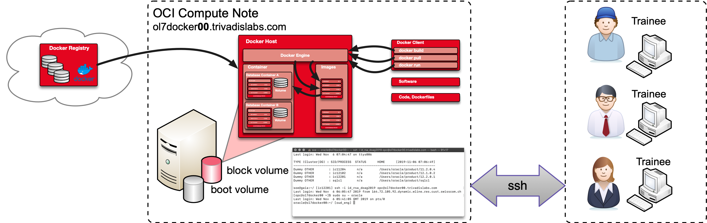

# Workshop Introduction

## Requirements Workshop Environment

During the workshop ***O-DB-DOCKER*** *Oracle-Databases in Docker-Containers* there will be the possibility to explore different topics with practical examples. Each participant will be provided with a compute node in the Oracle Cloud for the duration of the ***O-DB-DOCKER*** training. Alternatively, participants can perform the exercises in their own local VM or Docker environment. Participants are free to choose which environment they want to use for the workshop. Although the setup of the local VM respectively local Docker environment is not part of the workshop itself. The following summary gives a short overview of the different requirements for the three workshop environments.

Detailed information on the workshop environment, documents, instructions etc. are available prior to the training via [DOAG2019 O-DB-DOCKER](https://url.oradba.ch/DOAG2019_O-DB-DOCKER).

## Skills and Knowledge

The different exercises of the workshop allow a step-by-step introduction to the topic *Oracle databases in Docker containers*. The following knowledge of the participants is recommended:

* Oracle database basics like installation, configuration and basic database administration
* Docker basics (see also [Get Started, Part 1: Orientation and setup](https://docs.docker.com/get-started/))
* Practical experience with shell scripts, SSH and the command line.

## Compute Node in the Oracle Cloud

The Compute Node in the Oracle Cloud will be specially prepared for this workshop and will be available for practical work for the duration of the training. Each compute node is configured as follows:

* *Host name:* ol7dockerXX.trivadislabs.com (See host overview provided by the teacher.)
* *Internal IP address:* 10.0.0.2
* *External IP address:* See host overview provided by the teacher.
* *VM shape:* VM.Standard2.2
    * *CPU:* 2.0 GHz Intel® Xeon® Platinum 8167M (2 Cores)
    * *Memory:* 30GB
    * *Disk:* ca 256GB
* *Software:* 
  * Oracle Enterprise Linux 7.7
  * Docker Engine / Community Edition
  * Predefined Docker Images
  * Miscellaneous Oracle binaries and Git client

The following figure gives an overview of the OCI compute instance and access via SSH. Detailed installation and configuration guide can be found in [Appendix A](#appendix-a-setup-oci-environment).

Access to the compute nodes is exclusively via SSH and Private Keys. Workshop participants must ensure that they meet the following requirements:

* *SSH client* for remote access, e.g. Putty, MobaXterm or similar.
* *SCP Client* to copy files remotely, e.g. WinSCP, Putty or similar.
* *Text editor* for customizing / developing docker files, scripts etc. e.g. MS Visual Studio Code, UltraEdit, Notepad++ or similar
* It must also be ensured that access to a public IP address or host name is possible via an SSH key.

The following *optional* points are recommended:

* GitHub account to access and download the source code. Simple download does not require an account.

## Local Vagrant VM

As with compute nodes, all exercises can be performed directly in a Local VM. Appropriate vagrant scripts for building a VM are available in the Git Repository [oehrlis/o-db-docker](https://github.com/oehrlis/o-db-docker). The following requirements must be met in order to set up this VM with Vagrant:

* [Virtualbox](https://www.virtualbox.org/wiki/Downloads)
* [Vagrant](https://www.vagrantup.com)
* Local clone of the Git repository [oehrlis/o-db-docker](https://github.com/oehrlis/o-db-docker)
* Oracle Binaries for Oracle 19c and current RU.
* Sufficient hard disk space for the VM and the Docker Images approx. 50GB
* If necessary, additional tools to access and work with the VM, e.g. SSH client, text editor, etc.

Setting up a local VM is not part of the workshop. Participants who wish to work with a VM must configure it in advance. Detailed installation and configuration guide can be found in [Appendix B](#appendix-b-setup-vagrant-environment).

## Local Docker Environment

As a third option, the exercises can also be performed in a local docker environment. This is especially useful for working on Linux or MacOS notebooks. In order to perform the workshop locally, the following requirements must be met:

* Installing the Docker Community Edition. See also [About Docker - Community](https://docs.docker.com/install/)
* Local clone of the Git repository [oehrlis/o-db-docker](https://github.com/oehrlis/o-db-docker)
and [oracle/docker-images)](https://github.com/oracle/docker-images)
* Oracle Binaries for Oracle 19c and current RU.
* Sufficient hard disk space for the VM and the Docker Images approx. 50GB
* If necessary, additional tools to access and work with the VM, e.g. SSH client, text editor, git client etc.

Building a local Docker environment is not part of the workshop. Participants who wish to work with a local Docker installation must configure it in advance. detailed installation and configuration guide can be found in [Appendix C](#appendix-c-setup-local-docker-environment).

