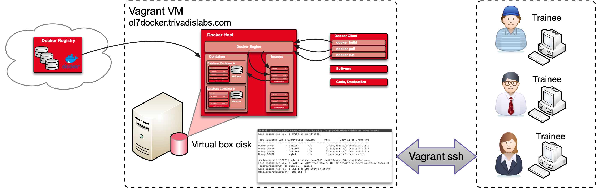

# Appendix B Setup Vagrant Environment

## Requirements and Preparations

The following appendix contains a step-by-step guide on how to set up the workshop environment with local Virtualbox installation. The different steps are performed via command line and scripts. 

The following prerequisites must be fulfilled:

- Oracle Virtual Box https://www.virtualbox.org/
- Oracle Vagrant Box https://yum.oracle.com/boxes
- Vagrant https://www.vagrantup.com/
- optional local git client. 
- And binaries required to build the Docker images e.g. Oracle database softwar

The following figure shows the schematic layout of the Docker environment based on Vagrant / Virtualbox. The provided vagrant environment does only have a minimal disk setup. It may be necessary to add an additional hard disk or extend the existing one.



## Setup Using Vagrant

The installation and configuration of the VM is fairly straightforward using vagrant. 

* Add the latest Oracle Linux 7 vagrant box

```bash
vagrant box add --name ol7-latest https://yum.oracle.com/boxes/oraclelinux/latest/ol7-latest.box
```

* Clone the O-DB-DOCKER git Repository to you local working or development directory

```bash
git clone https://github.com/oehrlis/o-db-docker.git o-db-docker
```

* Change to the LAB Vagrant folder.

```bash
cd o-db-docker/lab/ol7docker
```

* Install Vagrant Plugin's.

```bash
vagrant plugin install vagrant-reload
vagrant plugin install vagrant-vbguest
```

* Setup virtualbox using vagrant

```bash
vagrant up
```

* as soon as the VM provisioning is finished you can login.

```bash
vagrant ssh
```

* Within the VM you now can switch to user Oracle and run docker commands.

```bash
sudo su - oracle
docker images
```

The VM is now basically ready to work with Docker. The Git repositories for [O-DB-DOCKER](https://github.com/oehrlis/o-db-docker) as well as [oracle/docker-images](https://github.com/oracle/docker-images) and [oehrlis/docker](https://github.com/oehrlis/docker) are available under /xx. Nevertheless there are a few things to consider.

- Oracle binaries and patches must be downloaded separately. Ideally, the software is made available via a shared folder in order not to occupy the disk space in the VM. 
- Available disk space is at best too small for many Oracle Docker images. Either create bind mount's on a VM shared folder or increase disk space.
- The O-DB-DOCKER workshop does provide a couple of pre-build docker images, which are not available within a local VM. This is not an issue, since all images, volumes etc can be build. It just takes some time.

## Manual Setup

The O-DB-DOCKER environment can also be installed manually on an existing Oracle VM. The following steps have to be performed.

- Update the OEL 7 OS using `yum upgrade`
- Install the latest `docker-engine` and `docker-compose` via yum.
- Configure a dedicated docker volume / disk
- Configure a user which is used for Docker Engineering.

### Manual Setup Using the Vagrant Scripts

The scripts used to setup the Vagrant VM can be used to setup / configure an existing VM. So that not all paths have to be adapted, the scripts are simply copied to a directory /vagrant on the VM.

- Copy all vagrant files from VM host to the VM.

```bash
scp -r o-db-docker/lab/ol7docker VMNAME:/vagrant
```

- Manual run the vagrant provisioning script to setup the OS (update yum packages, install oracle packages and create an oracle user)

```bash
cd /vagrant
scripts/01_setup_os_db.sh
```

- Manual install oudbase environment

```bash
scripts/10_configure_oudbase.sh
```

- Clone git repositories using the script

```bash
scripts/11_clone_git_repos.sh
```

- install some base images

```bash
scripts/12_pull_base_images.sh
```

### Manual Setup Using the oradba_init Scripts

The vagrant setup scripts are all based on the [oradba_init](https://github.com/oehrlis/oradba_init) scripts. VM can therefor also configured using these scripts.

- Install the OraDBA init scripts

```bash
mkdir -p /tmp/download

curl -Lsf https://raw.githubusercontent.com/oehrlis/oradba_init/master/bin/00_setup_oradba_init.sh \
    -o /tmp/download/00_setup_oradba_init.sh

chmod 755 /tmp/download/00_setup_oradba_init.sh
/tmp/download/00_setup_oradba_init.sh
rm -rf /opt/oradba/oradba_init-master
```

- Run the OS install script. This script does install oracle preinstall packages and creates an oracle user

```bash
/opt/oradba/01_setup_os_db.sh
```

- Run the Docker install script. Just install `docker-engine` and `docker-compose`.

```bash
/opt/oradba/01_setup_os_docker.sh
```

- install git client

```bash
yum install git -y
```

- Install OUD base a simple Oracle environment similar to Trivadis BasEnv.
  
```bash
/opt/oradba/20_setup_oudbase.sh
```

- Clone the git repo either as user root, oracle or any other user you plan to use.

```bash
export ORACLE_BASE=${ORACLE_BASE:-/u00/app/oracle}
su -l oracle -c "cd ${ORACLE_BASE}/local;git clone https://github.com/oehrlis/o-db-docker.git"
su -l oracle -c "cd ${ORACLE_BASE}/local;git clone https://github.com/oehrlis/docker.git"
su -l oracle -c "cd ${ORACLE_BASE}/local;git clone https://github.com/oracle/docker-images.git"
```

- Pull a couple of docker base images.

```bash
docker pull busybox
docker pull alpine
docker pull oraclelinux:7-slim
```

**Disclaimer**: This guide has been created with utmost care, but does not claim to be complete. It was compiled as part of the preparation for the *O-DB-DOCKER* workshop. The author assumes no responsibility for the accuracy, completeness and timeliness of the content. The use of the available content is at your own risk.