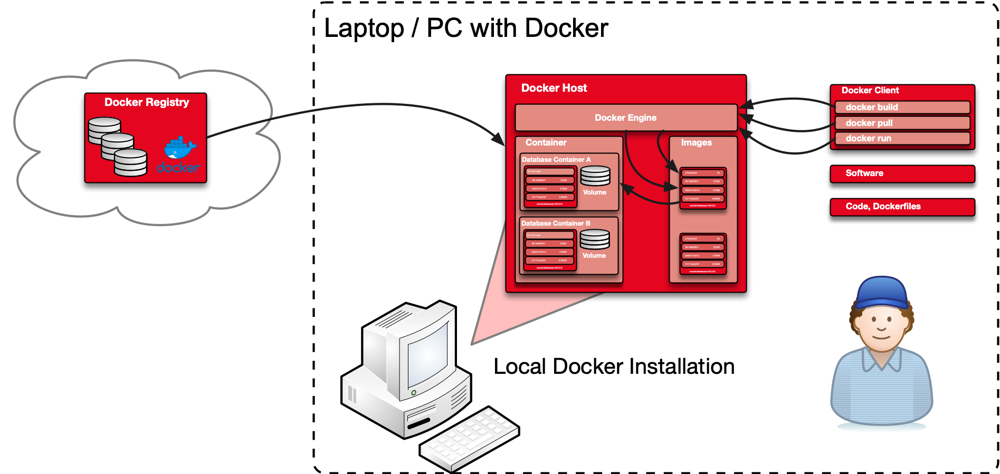

# Appendix C Setup local Docker Environment

## Requirements and Preparations

The following appendix contains a step-by-step guide on how to set up the workshop environment with local Docker installation. The different steps are performed via command line and scripts. 

The following prerequisites must be fulfilled:

- Docker Community Edition https://docs.docker.com/install
- git to check out the different git repository. Either git commandline or git desktop.
- Software required to setup the Docker images eg. the Oracle binaries.



## Configure local Docker Environment

The configuration of a local Docker environment is rather simple. Depending on your OS you just have to install the Docker Community Edition for MacOS, Windows or Linux according the official Docker documentation. As soon as you have Docker install you have to prepare the software.

- clone git repositories

```bash
cd /u00/app/oracle/local
git clone https://github.com/oehrlis/docker.git docker
git clone https://github.com/oehrlis/o-db-docker.git o-db-docker
git clone https://github.com/oracle/docker-images.git docker-images
```

- create folder for you software

```bash
mkdir /u00/app/oracle/software
```

- download the different oracle binaries as required

**Disclaimer**: This guide has been created with utmost care, but does not claim to be complete. It was compiled as part of the preparation for the *O-DB-DOCKER* workshop. The author assumes no responsibility for the accuracy, completeness and timeliness of the content. The use of the available content is at your own risk.