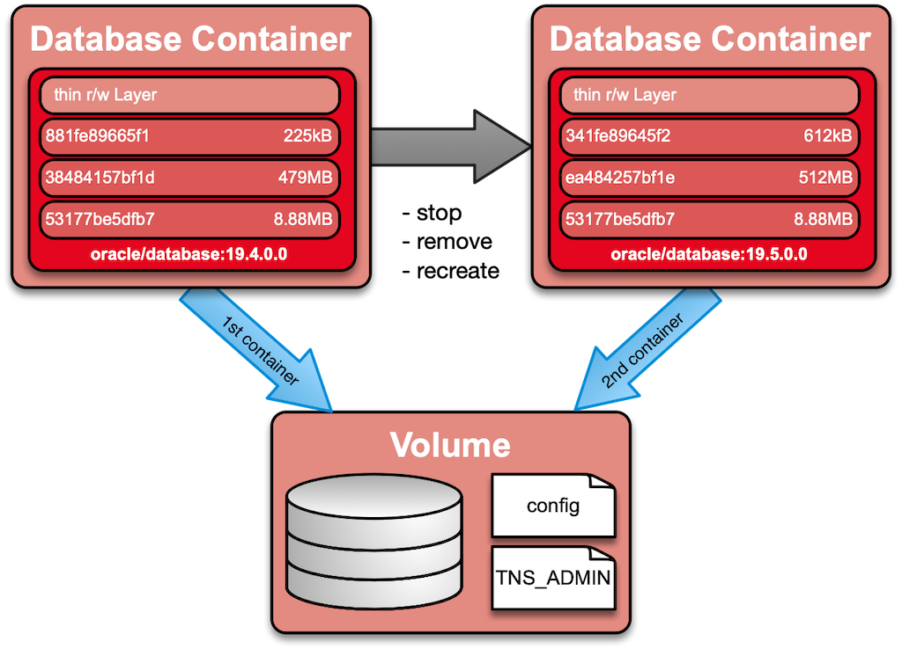

## Solution 12: Oracle Enterprise User Security

The following steps are performed in this exercise:

- Review the `docker-compose.yml`
- Start the container using `docker-compose`
- Test Oracle Names Resolution within the database container.
- Test EUS Login within the database container.

<!-- Stuff between the <div class="notes"> will be rendered as pptx slide notes -->
<div class="notes">
</div>

<!-- Stuff between the <div class="no notes"> will not be rendered as pptx slide notes -->
<div class="no notes">

### Background Information

This example shows how to install an Oracle release update (RU) on an Oracle database in a Docker Container. The persistent data (e.g. data files, config files etc.) is stored on an external volume. This allows to stop /remove the container and create a new one based on a Docker image with additional RU's, patch etc. The startup script `00_run_datapatch.sh` will run Oracle *datapatch* to apply / rollback the patch in the database. Some prerequisites and basic principles:

- `00_run_datapatch.sh` does check if you database has java installed. If so, it will restart the database in upgrade mode to run *datapatch*.
- If database is a container database the PDB's will be open to run datapatch.
- This use case does only run within an Oracle major release eg. 19.x.0.0 or 18.x.0.0 but not as an method to upgrade from 18c to 19c.
- It is relevant it you have a basic container with an RU or any kind of one-off patch.

The following figure illustrates the patch process of an Oracle database container.




### Detailed Solution

The following steps have been performed on the *ol7docker00* host. If necessary, adjust the commands, filenames or the host name according to your environment.

- Start a Putty session from command line.

```bash
putty -ssh opc@ol7docker00.trivadislabs.com -i keys/id_rsa_ol7docker00.ppk
```

- Alternatively start a SSH session from command line

```bash
ssh opc@ol7docker00.trivadislabs.com -i id_rsa_ol7docker00
```


- Switch to user *oracle*
- Run *docker images* to see which images are available
- Check the different directories.


</div>
