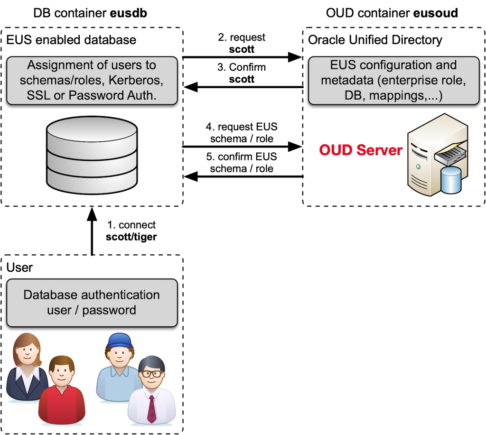

## Solution 12: Oracle Enterprise User Security

The following steps are performed in this exercise:

- Review the `docker-compose.yml`
- Start the container using `docker-compose`
- Test Oracle Names Resolution within the database container.
- Test EUS Login within the database container.

<!-- Stuff between the <div class="notes"> will be rendered as pptx slide notes -->
<div class="notes">
</div>

<!-- Stuff between the <div class="no notes"> will not be rendered as pptx slide notes -->
<div class="no notes">

### Background Information

This example shows how to configure an Oracle Database with Enterprise User Security and Oracle Unified directory. The persistent data (e.g. data files, config files etc.) is stored on an external volume. The start scripts are configured in the way, that the database does register itself in OUD and then configure EUS. Some prerequisites and basic principles:

- To automate the setup the two container do share a common configuration directory `./oud`. This allows to share information like the *eusadmin* password and the trusted *certificate*.
- The compose file does also include a service for OUDSM.
- The setup of Oracle Unified Directory includes a sample set of directory users.
- The database does setup an HR schema suitable for the sample schema.

The following figure illustrates the an Oracle Database and Oracle Unified Directory container with Enterprise User Security (EUS).



Oracle Unified Directory does use the following scripts to setup the OUD with EUS:

- `00_init_environment` File for setting the instance-specific environment. The setup scripts are based on the OUD Base environment. 
- `01_create_eus_instance.sh` Script to create the OUD instance with EUS context using oud-setup.
- `02_config_basedn.sh` Wrapper script to configure base DN and add ou's for users and groups.
- `02_config_basedn.ldif` LDIF file loaded by wrapper script `02_config_basedn.sh`. 
- `03_config_eus_realm.sh` Wrapper script to configure EUS realm to the OUD instance.
- `03_config_eus_realm.ldif]` LDIF file loaded by wrapper script `03_config_eus_realm.sh`.
- `04_config_oud.sh` Wrapper script to configure the OUD instance.
- `04_config_oud.conf` dsconfig batch file loaded by wrapper script `04_config_oud.sh`.
- `05_update_directory_manager.sh` Adjust cn=Directory Manager to use new password storage scheme
- `06_create_root_users.sh` Wrapper script to create additional root user.
- `06_create_root_users.conf` dsconfig batch file loaded by wrapper script `06_create_root_users.sh`.
- `06_create_root_users.ldif` LDIF file loaded by wrapper script `06_create_root_users.sh`.
- `07_create_eusadmin_users.sh` Script to create EUS Context Admin according to MOS Note 1996363.1.
- `08_create_demo_users.sh` Wrapper script to create a couple of users and groups.
- `08_create_demo_users.ldif` LDIF file loaded by wrapper script `08_create_demo_users.sh`.
- `09_migrate_keystore.sh` Script to migrate the java keystore to PKCS12.
- `10_export_trustcert_keystore.sh` Script to export the java keystore to PKCS12.
- `11_create_eus_ou_tree.conf` dsconfig batch file loaded by wrapper script `11_create_eus_ou_tree.sh`.
- `11_create_eus_ou_tree.ldif` LDIF file loaded by wrapper script `03_config_eus_realm.sh`.
- `11_create_eus_ou_tree.sh` Script to create additional root user.

The Database does run the fallowing scripts during initial setup:

- `01_create_scott.sql` Wrapper script for ``utlsampl.sql`` to create the SCOTT schema.
- `02_create_tvd_hr.sql` Script to create the TVD_HR schema. TVD_HR schema corresponds to Oracle's standard HR schema. The data has been adjusted so that it matches the example LDAP data of *trivadislabs.com* |
- `03_eus_registration.sh` Script to register database in OUD instance using `dbca`.
- `04_eus_config.sql` Script to create the EUS schemas for global shared and private schemas.
- `05_eus_mapping.sh` Script to create the EUS mapping to different global shared and private schemas as well global roles.
- `06_keystore_import_trustcert.sh` Script to import the trust certificate into java keystore.

### Use predefined Volumes

Since it takes a while to setup the database, we have predefined volumes for OUD, OUDSM and the database.

- Create and start all containers

```bash
docker-compose up -d
```

- check the status of the containers

```bash
docker-compose logs -f
```

### Re-Create the Containers

To see how the EUS setup does work, it make sense to remove the volumes and create everything from scratch.

- remove the volumes

```bash
docker volume rm ex12_db-eusdb
docker volume rm ex12_oud-eusoud
docker volume rm ex12_oud-eusoudsm
```

- Create and start all containers. This will take a while until the database is created.

```bash
docker-compose up -d
```

- check the status of the containers

```bash
docker-compose logs -f
```

### Test EUS

Test the EUS configuration using sqlplus. Alternatively you can also connect SQLDeveloper, etc.

```bash
sqlplus king/LAB01schulung@localhost:5521/TEUS01

@db/scripts/sousrinf
```

Check the session context

```sql
set linesize 160 pagesize 200
col NAMESPACE for a30
col ATTRIBUTE for a30
col VALUE for a50
SELECT * FROM session_context;
SELECT * FROM session_roles;
```

Select *employee* table as user *king*.

```sql
conn king/LAB01schulung
SELECT first_name,last_name,email FROM tvd_hr.employees;
```

Select *employee* table as user *bond*.

```sql
conn bond/LAB01schulung
SELECT first_name,last_name,email FROM tvd_hr.employees;
```

Select *employee* table as user *moneypenny*.

```sql
conn moneypenny/LAB01schulung
SELECT first_name,last_name,email FROM tvd_hr.employees;
```

VPD does limit the access to tvd_hr.employees based on LDAP attributes.
</div>
